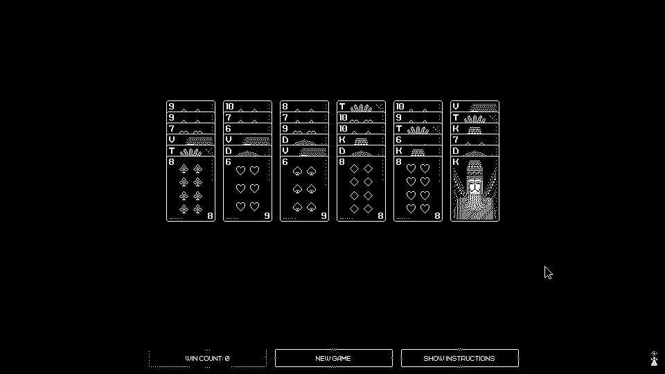

# NEA

My programming project - A solver for the [*MOLEK-SYNTEZ*](https://store.steampowered.com/app/1168880/MOLEKSYNTEZ/) solitaire game

## Analysis

### The problem

The Solitaire minigame within *MOLEK-SYNTEZ* is laid out as follows:

A pack of Russian playing cards (36 cards - 6-10 and T, K, D, V) are dealt into a 6x6 grid. The objective is to form piles in descending order, from T to 6.

Descending runs can be moved as a single stack, so parts of runs can be moved quickly and easily.

If a complete stack (T-6) is placed onto an empty column, the entire column will lock.

If there aren't any legal moves available, the player may cheat by placing one card on top of a stack which would normally be illegal. Only one cheated card can be on each stack at any time, however; and cheated cards may not be moved to other illegal positions; therefore the game is still tricky.

### Features of the problem that are amenable to computational methods

The possible solution space for a randomly-generated solitaire is very large - while a human may be able to use some intuition, humans make mistakes; as the solitaire comes with no undo button this makes the game much harder to solve by hand.

### Why the problem lends itself to a computational solution

The problem is solvable computationally, by using a backtracking exhaustive algorithm; it tries as many moves as it can make, and if it reaches a point with no valid moves, it will go back until it has another valid move to make. It could be considered to be enumerative.

Furthermore, there is a medal for completing the solitaire game without cheating; the medal was designed with the intent of being unobtainable (however there are boards which can be solved without cheating) - a computer is far more likely to find these solutions than a person.

### Stakeholders

*Stakeholders were given the option to remain anonymous when signing up. This means some data will not be in this table or will be less specific.*

| Name                                    | Age   | Gender          | Operating System(s) |
|-----------------------------------------|-------|-----------------|---------------------|
| Toby Collier                            | 17    | Male            | Windows/Linux       |
| id-05012e5c-1462-4510-9fa3-e7e92b1062a9 | 45-50 | *\[anonymous\]* | Windows             |
| id-d1274b61-aa9e-4300-8efe-ba1d5bca03a8 | 15-20 | *\[anonymous\]* | Windows             |

<!-- TODO: get more stakeholders -->

### How the solution is appropriate to the needs of the stakeholders

The solution will be fully automatic, and will be customisable (allow the solver to cheat, limit its search depth, etc) as well as displaying, as part of a graphical interface, what the computer 'sees' (the app window will include a live board capture complete with the vision engine's decisions)

### Objectives

- [ ] The solver must have a graphical configuration interface
  - [ ] The configuration interface must contain a 'live' display of the vision
- [ ] The solver must support configuration:
  - [ ] Maximum search depth (number of moves)
  - [ ] Allow/disallow/allow only when exhausted cheating

<!-- TODO: maybe more -->

### Research

Previously, my father and I [wrote a similarly-intented solver](https://www.youtube.com/watch?v=1MugAxSGbc8) for the ПАСЬЯНС (patience) minigame in [another Zachtronics game, *EXAPUNKS*](https://store.steampowered.com/app/716490/EXAPUNKS/). The source and release can be found [here](http://starbright.dyndns.org/starwort/patience/).

A user by the name Hegemege has also [created a solver for the solitaire](https://github.com/Hegemege/molek-syntez-solitaire-bot), however their solution [uses a heuristic](https://github.com/Hegemege/molek-syntez-solitaire-bot/blob/master/game_state.py#L244-L267) to narrow down its states and mine will use backtracking to perform a more exhaustive search

### Commentary

I previously (several months ago) began collecting some sample screen captures, and wrote a small framework ([solver/](./solver)). Additionally, the [common.c](solver_c/common.c), [common.h](solver_c/common.h), and [variadicmacros.h](solver_c/variadicmacros.h) are part of my personal C workspace and are copied here for completeness.

I have also created a makefile, and copied my formatter configuration here, to make the build process easier.

Full information about the progress I make will be available in [the changelog](./CHANGELOG.md)

## To-do

- [x] Create a clear description of the problem
- [x] Describe and justify of the features of the problem which are solvable by computational methods
- [x] Explain why the problem is amenable to a computational solution
- [x] Identify and describe the stakeholders in the solution
- [x] Explain how the solution is appropriate to the needs of the stakeholders
- [ ] Decide on methods of research for each stakeholder
- [ ] Plan interview questions
- [ ] Plan survey questions
- [ ] Decide how I will follow up my research
- [x] Identify other existing systems or ideas I can research
- [x] Discuss any suitable approaches to a solution
- [x] Create a requirements specification
- [ ] Justify each requirement based on the research evidence
- [ ] State measurable success criteria for each requirement
- [ ] Discuss any hardware and software that will be needed
