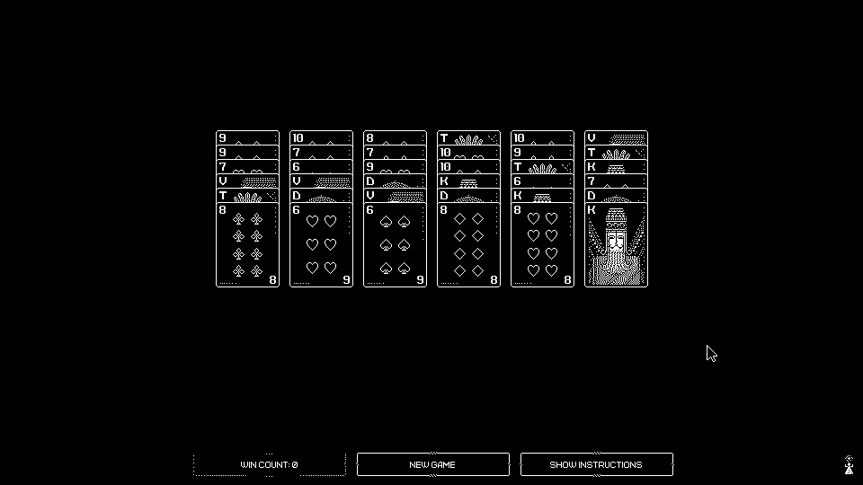
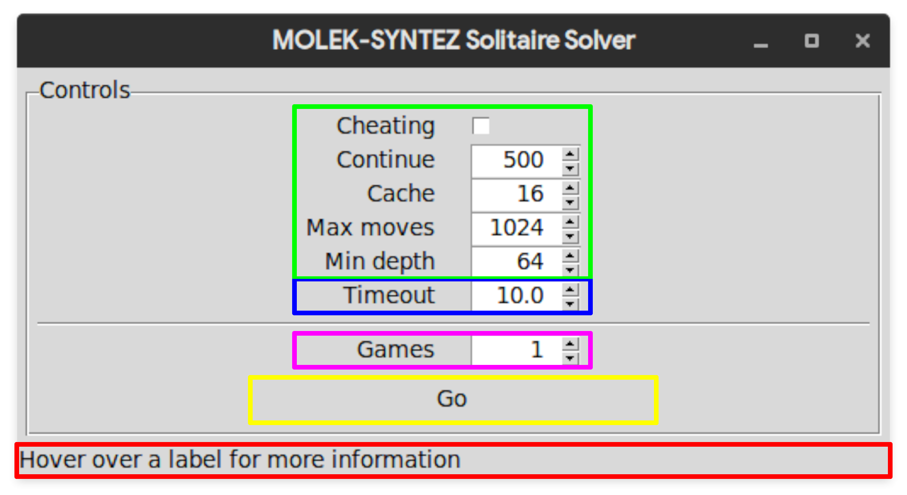

# NEA

My programming project - A solver for the [*MOLEK-SYNTEZ*](https://store.steampowered.com/app/1168880/MOLEKSYNTEZ/) solitaire game

[](./samples/full.png)

## Analysis

### The problem

The Solitaire minigame within *MOLEK-SYNTEZ* is laid out as follows:

A pack of Russian playing cards (36 cards - 6-10 and T, K, D, V) are dealt into a 6x6 grid. The objective is to form piles in descending order, from T to 6.

Descending runs can be moved as a single stack, so parts of runs can be moved quickly and easily.

If a complete stack (T-6) is placed onto an empty column, the entire column will lock.

If there aren't any legal moves available, the player may Cheat by placing one card on top of a stack which would normally be illegal. Only one Cheated card can be on each stack at any time, however; and Cheated cards may not be moved to other illegal positions; therefore the game is still tricky.

### Features of the problem that are amenable to computational methods

The possible solution space for a randomly-generated solitaire is very large - while a human may be able to use some intuition, humans make mistakes; as the solitaire comes with no undo button this makes the game much harder to solve by hand.

### Why the problem lends itself to a computational solution

The problem is solvable computationally, by using a backtracking exhaustive algorithm; it tries as many moves as it can make, and if it reaches a point with no valid moves, it will go back until it has another valid move to make. It could be considered to be enumerative.

Furthermore, there is a medal for completing the solitaire game without Cheating; the medal was designed with the intent of being unobtainable (however there are boards which can be solved without Cheating) - a computer is far more likely to find these solutions than a person.

### Stakeholders

*Stakeholders were given the option to remain anonymous when signing up. This means some data will not be in this table or will be less specific.*

| Name                                    | Age   | Gender          | Operating System(s) |
|-----------------------------------------|-------|-----------------|---------------------|
| Toby Collier                            | 17    | Male            | Windows/Linux       |
| id-05012e5c-1462-4510-9fa3-e7e92b1062a9 | 45-50 | *\[anonymous\]* | Windows             |
| id-d1274b61-aa9e-4300-8efe-ba1d5bca03a8 | 15-20 | *\[anonymous\]* | Windows             |
| id-d86d8cf5-156e-497d-bdbf-0ebb3a4a3ca8 | 15-20 | *\[anonymous\]* | Windows             |
| id-4b98d17e-c24e-49c6-a12a-2e95cbeee82a | 15-20 | *\[anonymous\]* | Windows             |

<!-- TODO: get more stakeholders -->

### How the solution is appropriate to the needs of the stakeholders

The solution will be fully automatic, and will be customisable ([don't] allow the solver to Cheat, limit its search depth, etc) as well as displaying, as part of a graphical interface, what the computer 'sees' (the app window will include a live board capture complete with the vision engine's decisions)

### Objectives

- [ ] Standalone solitaire game
  - [ ] Detect win
  - [ ] Detect legal moves
- [x] The solver must support configuration:
  - [x] Maximum search depth (number of moves)
  - [x] Allow/disallow Cheating
- [X] The solver should have a vision interface
  - [X] Read the board from the game with CV
- [X] The vision-solver must have a graphical configuration interface
  - [ ] The configuration interface should contain a 'live' display of the vision

<!-- TODO: maybe more -->

### Research

Previously, my father and I [wrote a similarly-intented solver](https://www.youtube.com/watch?v=1MugAxSGbc8) for the ПАСЬЯНС (patience) minigame in [another Zachtronics game, *EXAPUNKS*](https://store.steampowered.com/app/716490/EXAPUNKS/). The source and release can be found [here](http://starbright.dyndns.org/starwort/patience/).

A user by the name Hegemege has also [created a solver for the solitaire](https://github.com/Hegemege/molek-syntez-solitaire-bot), however their solution [uses a heuristic](https://github.com/Hegemege/molek-syntez-solitaire-bot/blob/master/game_state.py#L244-L267) to narrow down its states and mine will use backtracking to perform a more exhaustive search

<!-- TODO: compare other solitaire games -->
<!-- TODO: research frameworks; pygame, etc -->

### Commentary

I previously (several months ago) began collecting some sample screen captures, and wrote a small framework ([solver/](./solver)). Additionally, the [common.c](solver_c/common.c), [common.h](solver_c/common.h), and [variadicmacros.h](solver_c/variadicmacros.h) are part of my personal C workspace and are copied here for completeness.

I have also created a makefile, and copied my formatter configuration here, to make the build process easier.

Full information about the progress I make will be available in [the changelog](./CHANGELOG.md)

## Roadmap

1. Write standalone player
2. Write solver
3. Write computer vision
4. Write visualisation window

## To-do

- [x] Create a clear description of the problem
- [x] Describe and justify of the features of the problem which are solvable by computational methods
- [x] Explain why the problem is amenable to a computational solution
- [x] Identify and describe the stakeholders in the solution
- [x] Explain how the solution is appropriate to the needs of the stakeholders
- [x] Identify other existing systems or ideas I can research
- [x] Discuss any suitable approaches to a solution
- [x] Create a requirements specification

## Design

## GUI

[](./window_labelled.png)

The GUI has been illustrated, with coloured regions used to identify them. Below is a description of what each region contains.

- Green region
  - Options for the solver
  - Each option in this group corresponds to a single solver option
    - Cheating checkbox: `-c`
    - Continue spinbox: `-t`
    - Cache spinbox: `-n`
    - Max moves spinbox: `-m`
    - Min depth spinbox: `-d`
  - This is so that users already familiar with the command-line interface can use the GUI easily, and so that users learning with the GUI are able to switch to the CLI if they so desire
- Blue region
  - The timeout for the subprocess
  - To the user, this appears to fit into the solver parameters, and therefore it is grouped with them; however, it really controls the timeout of the subprocess call, which is used to interface with the solver.
- Magenta region
  - The number of games to solve, automatically
  - This is a parameter entirely separate from the solver options, and as such it is separated from them by a divider
- Yellow region
  - The 'Go' button
  - When pressed, it begins a thread which runs the solver wrapper (which has been rewritten to use the status bar instead of stdout), and transforms into a 'Stop' button
- Red region
  - The status bar
  - Displays the tooltips for the labels, as well as the last line of output from the solver thread. When not hovering over a label, will display the hint text 'Hover over a label for more information'

### Solver algorithm overview

```pseudocode
to solve a given board:
    see if the board is solved
        if it is, return no moves
    for each available move:
        make the move
        try to solve the new board
            if it was solved, return this move and those moves
        otherwise, undo the move
    there is no sequence of moves which can solve this board
```

Moves that are classed as 'available':

- Place a stack beginning with T from a non-empty stack onto an empty stack (it will never move from here)
- Place a stack beginning with *n* on a stack ending with *n* + 1 (K on T, D on K, V on D, 10 on V, 9 on 10, etc.)
- *Rules below this point apply only when Cheating is enabled*
- Move a stack consisting of a single card onto a column which does not contain a Cheated card
- Move a Cheated card from one column to another when an identical card is available in a valid position (this is really two moves, but is considered as one by the solver)

### Solver data formats

#### Input

##### Board state

The board state passed to the solver is represented as a single string consisting of 6 columns.

Each column consists of a sequence of up to fourteen characters, representing the cards in the column, consisting solely of `T`, `K`, `D`, `V`, `0`, `9`, `8`, `7`, or `6`; terminated by a full stop (`.`) or exclamation mark (`!`), representing whether the top card of the column is Cheated (`!`) or not (`.`).

The solver accepts 5 options:

- `-c`
  - Allow Cheating.
  - The solver will only attempt to Cheat if a solution cannot be found without Cheating.
- `-n <cache boundary>`
  - The maximum number of moves remaining for the board state to be cached.
  - Defaults to `16`.
  - If set to `-1`, all board states are cached. (Not recommended).
- `-t <milliseconds>`
  - How long to continue searching for a more optimal solution after one is found.
  - Defaults to `500` (0.5 seconds).
  - If set to `-1`, the solver will search all possibilities to find the most optimal solution.
- `-d <maximum moves>`
  - The minimum maximum number of moves to allow.
  - Defaults to `64`.
  - Setting this to very low or very high values will increase run time and memory consumption.
- `-m <maximum moves>`
  - The maximum number of moves to allow.
  - Defaults to `1024`.
  - Very large values will cause allocation errors.
  - It is recommended to make this a multiple of 4 as the solver will only attempt to solve with maximum depths of multiples of 4.
- `-h`
  - Print the help message and exit.

### Output

The solver outputs a sequence of moves, each formatted as `x y -> new_x new_y`, or `x y !> new_x new_y` for a Cheat move. For example, to move column `1` from card `3` to column `2` at card `5`: `1 3 -> 2 5`.

Additionally, if no solution is found in [depth] moves, it will print a message to standard error stating such: `No solution found in <depth> moves`

The solver attempts to solve with an initial search depth of the minimum maximum search depth; if no solution is found, the maximum search depth is incremented by 4 until the specified maximum is exceeded.
