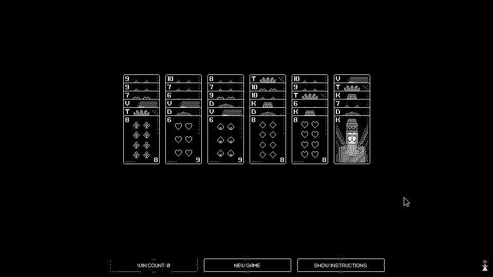
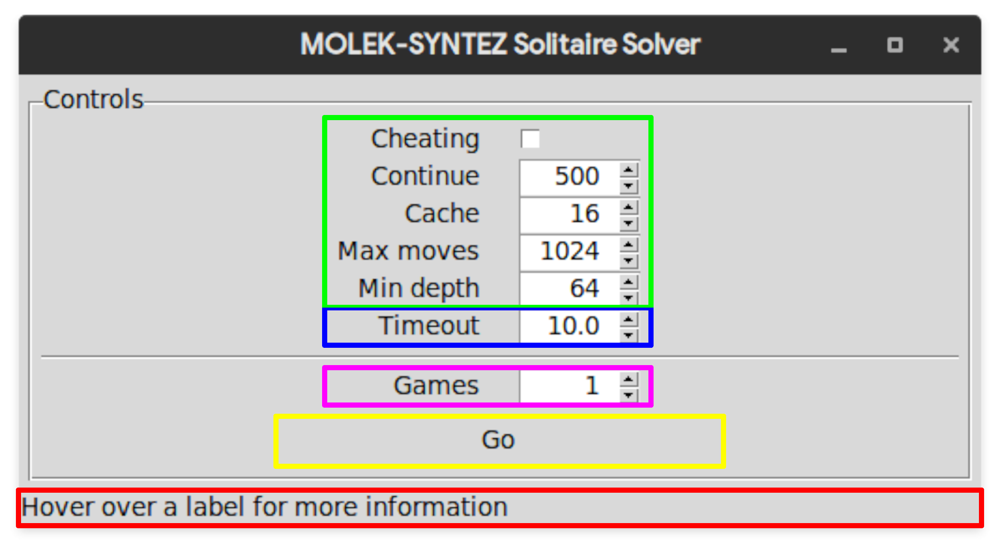

# NEA

My programming project - A solver for the [*MOLEK-SYNTEZ*](https://store.steampowered.com/app/1168880/MOLEKSYNTEZ/) solitaire game

[](./samples/full.png)

## Analysis

### The problem

The Solitaire minigame within *MOLEK-SYNTEZ* is laid out as follows:

A pack of Russian playing cards (36 cards - 6-10 and T, K, D, V) are dealt into a 6x6 grid. The objective is to form piles in descending order, from T to 6.

Descending runs can be moved as a single stack, so parts of runs can be moved quickly and easily.

If a complete stack (T-6) is placed onto an empty column, the entire column will lock.

If there aren't any legal moves available, the player may Cheat by placing one card on top of a stack which would normally be illegal. Only one Cheated card can be on each stack at any time, however; and Cheated cards may not be moved to other illegal positions; therefore the game is still tricky.

### Features of the problem that are amenable to computational methods

The possible solution space for a randomly-generated solitaire is very large - while a human may be able to use some intuition, humans make mistakes; as the solitaire comes with no undo button this makes the game much harder to solve by hand.

### Why the problem lends itself to a computational solution

The problem is solvable computationally, by using a backtracking exhaustive algorithm; it tries as many moves as it can make, and if it reaches a point with no valid moves, it will go back until it has another valid move to make. It could be considered to be enumerative.

Furthermore, there is a medal for completing the solitaire game without Cheating; the medal was designed with the intent of being unobtainable (however there are boards which can be solved without Cheating) - a computer is far more likely to find these solutions than a person.

### Stakeholders

*Stakeholders were given the option to remain anonymous when signing up. This means some data will not be in this table or will be less specific.*

| Name                                    | Age   | Gender          | Operating System(s) |
| --------------------------------------- | ----- | --------------- | ------------------- |
| Toby Collier                            | 17    | Male            | Windows/Linux       |
| id-05012e5c-1462-4510-9fa3-e7e92b1062a9 | 45-50 | *\[anonymous\]* | Windows             |
| id-d1274b61-aa9e-4300-8efe-ba1d5bca03a8 | 15-20 | *\[anonymous\]* | Windows             |
| id-d86d8cf5-156e-497d-bdbf-0ebb3a4a3ca8 | 15-20 | *\[anonymous\]* | Windows             |
| id-4b98d17e-c24e-49c6-a12a-2e95cbeee82a | 15-20 | *\[anonymous\]* | Windows             |

<!-- TODO: get more stakeholders -->

### How the solution is appropriate to the needs of the stakeholders

The solution will be fully automatic, and will be customisable ([don't] allow the solver to Cheat, limit its search depth, etc) as well as displaying, as part of a graphical interface, what the computer 'sees' (the app window will include a live board capture complete with the vision engine's decisions)

### Objectives

- [ ] Standalone solitaire game
  - [ ] Detect win
  - [ ] Detect legal moves
- [x] The solver must support configuration:
  - [x] Maximum search depth (number of moves)
  - [x] Allow/disallow Cheating
- [x] The solver should have a vision interface
  - [x] Read the board from the game with CV
- [x] The vision-solver must have a graphical configuration interface
  - [ ] The configuration interface should contain a 'live' display of the vision

<!-- TODO: maybe more -->

### Research

Previously, my father and I [wrote a similarly-intented solver](https://www.youtube.com/watch?v=1MugAxSGbc8) for the ПАСЬЯНС (patience) minigame in [another Zachtronics game, *EXAPUNKS*](https://store.steampowered.com/app/716490/EXAPUNKS/). The source and release can be found [here](http://starbright.dyndns.org/starwort/patience/).

A user by the name Hegemege has also [created a solver for the solitaire](https://github.com/Hegemege/molek-syntez-solitaire-bot), however their solution [uses a heuristic](https://github.com/Hegemege/molek-syntez-solitaire-bot/blob/master/game_state.py#L244-L267) to narrow down its states and mine will use backtracking to perform a more exhaustive search

<!-- TODO: compare other solitaire games -->
<!-- TODO: research frameworks; pygame, etc -->

### Commentary

I previously (several months ago) began collecting some sample screen captures, and wrote a small framework ([solver/](./solver)). Additionally, the [common.c](solver_c/common.c), [common.h](solver_c/common.h), and [variadicmacros.h](solver_c/variadicmacros.h) are part of my personal C workspace and are copied here for completeness.

I have also created a makefile, and copied my formatter configuration here, to make the build process easier.

## Roadmap

1. Write standalone player
2. Write solver
3. Write computer vision
4. Write visualisation window

## To-do

- [x] Create a clear description of the problem
- [x] Describe and justify of the features of the problem which are solvable by computational methods
- [x] Explain why the problem is amenable to a computational solution
- [x] Identify and describe the stakeholders in the solution
- [x] Explain how the solution is appropriate to the needs of the stakeholders
- [x] Identify other existing systems or ideas I can research
- [x] Discuss any suitable approaches to a solution
- [x] Create a requirements specification

## Design

## GUI

[](./window_labelled.png)

The GUI has been illustrated, with coloured regions used to identify them. Below is a description of what each region contains.

- Green region
  - Options for the solver
  - Each option in this group corresponds to a single solver option
    - Cheating checkbox: `-c`
    - Continue spinbox: `-t`
    - Cache spinbox: `-n`
    - Max moves spinbox: `-m`
    - Min depth spinbox: `-d`
  - This is so that users already familiar with the command-line interface can use the GUI easily, and so that users learning with the GUI are able to switch to the CLI if they so desire
- Blue region
  - The timeout for the subprocess
  - To the user, this appears to fit into the solver parameters, and therefore it is grouped with them; however, it really controls the timeout of the subprocess call, which is used to interface with the solver.
- Magenta region
  - The number of games to solve, automatically
  - This is a parameter entirely separate from the solver options, and as such it is separated from them by a divider
- Yellow region
  - The 'Go' button
  - When pressed, it begins a thread which runs the solver wrapper (which has been rewritten to use the status bar instead of stdout), and transforms into a 'Stop' button
- Red region
  - The status bar
  - Displays the tooltips for the labels, as well as the last line of output from the solver thread. When not hovering over a label, will display the hint text 'Hover over a label for more information'

### Solver algorithm overview

```
to solve a given board:
    see if the board is solved
        if it is, return no moves
    for each available move:
        make the move
        try to solve the new board
            if it was solved, return this move and those moves
        otherwise, undo the move
    there is no sequence of moves which can solve this board
```

Moves that are classed as 'available':

- Place a stack beginning with T from a non-empty stack onto an empty stack (it will never move from here)
- Place a stack beginning with *n* on a stack ending with *n* + 1 (K on T, D on K, V on D, 10 on V, 9 on 10, etc.)
- *Rules below this point apply only when Cheating is enabled*
- Move a stack consisting of a single card onto a column which does not contain a Cheated card
- Move a Cheated card from one column to another when an identical card is available in a valid position (this is really two moves, but is considered as one by the solver)

### Solver data formats

#### Solver arguments

The board state passed to the solver is represented as a single string consisting of 6 columns.

Each column consists of a sequence of up to fourteen characters, representing the cards in the column, consisting solely of `T`, `K`, `D`, `V`, `0`, `9`, `8`, `7`, or `6`; terminated by a full stop (`.`) or exclamation mark (`!`), representing whether the top card of the column is Cheated (`!`) or not (`.`).

The solver accepts 5 options:

- `-c`
  - Allow Cheating.
  - The solver will only attempt to Cheat if a solution cannot be found without Cheating.
- `-n <cache boundary>`
  - The maximum number of moves remaining for the board state to be cached.
  - Defaults to `16`.
  - If set to `-1`, all board states are cached. (Not recommended).
- `-t <milliseconds>`
  - How long to continue searching for a more optimal solution after one is found.
  - Defaults to `500` (0.5 seconds).
  - If set to `-1`, the solver will search all possibilities to find the most optimal solution.
- `-d <maximum moves>`
  - The minimum maximum number of moves to allow.
  - Defaults to `64`.
  - Setting this to very low or very high values will increase run time and memory consumption.
- `-m <maximum moves>`
  - The maximum number of moves to allow.
  - Defaults to `1024`.
  - Very large values will cause allocation errors.
  - It is recommended to make this a multiple of 4 as the solver will only attempt to solve with maximum depths of multiples of 4.
- `-h`
  - Print the help message and exit.

### Output

The solver outputs a sequence of moves, each formatted as `x y -> new_x new_y`, or `x y !> new_x new_y` for a Cheat move. For example, to move column `1` from card `3` to column `2` at card `5`: `1 3 -> 2 5`.

Additionally, if no solution is found in [depth] moves, it will print a message to standard error stating such: `No solution found in <depth> moves`

The solver attempts to solve with an initial search depth of the minimum maximum search depth; if no solution is found, the maximum search depth is incremented by 4 until the specified maximum is exceeded.
# Design of the Solitaire Solver

## Decomposition

The problem has been broken down as shown below:

1. Solver (written in C)
   1. Board state and parameter parsing
      1. Board state parsing is handled by my code
         - I decided to encode the board state in a simple-to-parse way in order to ease the writing of the solver
         - Each board is given to the solver as a 42-character string, consisting of 6 columns, each of which consists of up to 15 cards followed by a column terminator.
         - Each card is represented by a digit 6-9, the digit `0`, or a letter `T`, `K`, `D`, or `V`
         - Column terminators are the characters `.` and `!`, representing a column without a Cheat and a column with a Cheat, respectively
      2. Argument parsing is handled by `getopt`
         - This is a standard C module which is used to handle options
   2. Backtracking solution search
      - The solution search is recursive, using a backtracking algorithm:
        - to solve a given board:
          - see if the board is solved
            - if it is, return no moves
          - for each available move:
            - make the move
            - try to solve the new board
              - if it was solved, return this move and those moves
              - otherwise, undo the move
          - there is no sequence of moves which can solve this board
      - The real program differs slightly from this in order (the 'board is solved' check occurs after the move rather than at the beginning of the recursive step) and implementation (the sequence of moves is stored in a global array rather than returned dynamically from the functions, as C cannot do this easily)
      - Additionally, the solution search is repeated up to twice:
        - Once without Cheating (always)
          - If the board is possible to solve without Cheating, it is much faster to find this solution
        - Once with Cheating (only if Cheating is enabled, only if the first pass found no solution)
          - This can be *much* slower than searching without Cheating (finding a solution without Cheating can take under a tenth of a second, but with Cheating enabled can take several minutes)
   3. Solution output
      - The solution is printed to STDOUT
      - Each move in the solution is printed on its own line
        - Moves which do not Cheat are printed as `X Y -> TO_X TO_Y`, where `X`, `Y`, `TO_X`, and `TO_Y` represent the columns and rows of the card's source and destination
        - Moves which Cheat are printed as `X Y !> TO_X TO_Y`, where `X`, `Y`, `TO_X`, and `TO_Y` represent the columns and rows of the card's source and destination. Note that the only difference is in the arrow, and therefore users (or applications) who do not care if the solution Cheats or not can ignore it
2. Automation (written in Python)
   1. Vision
      1. Screenshot capture
         - Screenshot capture is delegated to the library `PyAutoGUI`. Where `PyGetWindow` (a requirement of `PyAutoGUI`) is available, the screenshot capture should* be more sophisticated

           *Assuming my function works correctly - I have not been able to test this as my primary development system is not supported by `PyGetWindow`
      2. Screenshot parsing
         - The game has a 'Pixel-Perfect' scaling mode, and therefore the vision is simpler than if anti-aliasing needed to be accounted for
         - The game screenshot can be scaled and cropped to the base resolution (960x540), and the positions of the cards can be calculated with a set of constants:
           - The column width, in pixels (82)
           - The row height, in pixels (16)
           - The position of the top left card, as a set of pixel co-ordinates, where the origin is at the top left of the screen ((244, 149))
         - Each card in the 6x6 grid (as the vision solver always starts a new game before recognising the image) can be identified using a 8x9 picture of the card's rank (these can be found in the `samples` directory), which are loaded in as constants and compared to the card (as found by cropping the full screenshot to the position of the card) using the `ImageChops` module of `PIL` (the Python Imaging Library, or rather its fork `Pillow`)
         - The board identification function then returns a 6-tuple of 6-tuples of 1-character strings
   2. Solver interface
      - The solver interface takes the Python representation of the board, as well as the required flags, translates them for the solver, and calls the solver.
        - There is also a wrapper function which will use the vision interface to determine the board on-screen
      - The function will determine the appropriate solver executable to use.
      - If running on Linux or MacOS, it will attempt to build the solver using `make` (which will not attempt to actually build the solver if it has done already).
      - It will then construct an argument list, using the determined solver executable path, the provided flags, and the provided board state, and uses `subprocess` to run the solver. `subprocess` is also used to enforce a timeout on the solver, so that it does not take too long (the default timeout is 10 seconds, more than enough for most boards).
      - Using the output of the solver, the function can parse the output into a list of moves which it will return, and optionally print some stats about the found solution.
   3. Input emulation
      - The input emulation interface contains only a couple of functions:
        - `click`, which clicks (and is used as an alternative to `pyautogui.click` as the clicks from this function fail to register)
        - `run_solution`, which takes a list of moves and executes the given solution. Optionally, it can also click the 'new game' button.

## Analysis with Data-Oriented design

The following data structures (which can be found within `types.h`) were needed for the C code:

- `Card`, which is an unsigned 8-bit number representing the value of a card.
- `Column`, which is a structure representing a single column, containing:
  - A fixed-size array of 15 `Card`s (large enough for the largest possible stack of cards: `XXXXXTKDV09876C`, where `X` is any card and `C` is any Cheated card)
  - An unsigned 8-bit integer, which stores the number of cards in this `Column`
  - An unsigned 8-bit integer, which stores the position of the beginning of the stack of `Card`s which may be moved together within this `Column`
  - A boolean containing whether or not this `Column` contains a Cheated `Card`
- `Board`, which is a structure representing the entire board, containing 6 `Column` pointers
  - This is the core structure for the project, and there is only ever one, which is global to the main file. It is loaded by parsing a string provided by the user, which takes a specific format (described in more detail in the previous breakdown) and is checked thoroughly in order to avoid segmentation faults.
- `Move`, which is a structure representing a single move, containing:
  - An unsigned 8-bit integer representing the column the card is moving from (as an index)
  - An unsigned 8-bit integer representing the row the card is moving from (as an index)
  - An unsigned 8-bit integer representing the column the card is moving to (as an index)
  - An unsigned 8-bit integer representing the row the card is moving to (as an index)
  - A boolean containing whether or not the move being made is a Cheat
  - A boolean containing whether or not the `Card` being moved was Cheated previously
- `BoardHashTable_LLNode`, which is a linked-list node for use in the hash table (an optimisation enabling the solver to prematurely discard states, based on whether it has encoutered them before or not)

## Analysis of the Graphical User Interface

In order to ease development of the Graphical User Interface (GUI), the library `pygubu` was used. This allows me to create the components via the editor `pygubu-designer`, as well as connecting the events and bindings, and then write the code to *implement* the callbacks more quickly. Using `pygubu` allows the graphics code to stay separate from my own code, with the limited exception that I need to understand that `tkinter` is being used internally, and as such avoid blocking its thread with my operations
# Evidence of Project Development

## Principles

- Modular development
  - The solver is broken up into small modules which each handle their own tasks; the program contains 8 individual modules (`board_info`, `common` `compress` `hash` `parse` `memory` `timer`) which each perform their own tasks and are used by the main program (Note that `common` is a general-purpose module I lifted straight from my personal C project folder, and as such many of its functions go unused in this project).
  - For example, `board_info` handles the board; from [its header file][1]:

    ```c
    bool legal_stack(const Column* col, uint8 position);
    uint8 stack_begin(const Column* col);
    bool can_move(const Board* board, Move* move);
    int column_if_two_moves(const Board* board, const Move* move);
    bool solved(const Board* board);
    void apply_move(Board* board, const Move* move);
    void unapply_move(Board* board, const Move* move);
    ```

    That is, it can:
    - Determine if stacking from a point is legal
    - Determine where the beginning of a stack is
    - Determine where the intermediary column of a two-step Cheat is
    - Determine if a `Board` is solved
    - Apply a `Move`; that is, perform the action described by `move` on the `board`
    - Unapply a `Move`; that is, the reverse of applying it (necessary for the algorithm to backtrack)
  - For an alternative example, `memory` handles all the memory related tasks (allocation and freeing of complex structures); from [its header file][2]:

    ```c
    Board* allocate_board();
    void free_board(Board* board);
    BoardHashTable_LLNode* create_node(const string board_state, int moves);
    void deallocate_list(BoardHashTable_LLNode* node);
    Move* copy_move(Move* move);
    ```

    Its responsibilities are:
    - Creation and destruction of `Board`s (handled with pointers to allow mutability, and is the reason these functions are necessary)
    - Creation of hash table nodes (also handled with pointers, as this is the only way to link them together)
    - Destruction of hash table linked lists (performed recursively, but likely to be tail-call optimised by the compiler)
    - Copying `Move`s (used to place moves on the stack while allowing mutation, so the solver may continue attempting to optimise its solution)
- Annotation of the code
  - All main functions in the solver's code are annotated, for example [the `can_move` function][3]:

    ```c
    /* Check if a given move is legal on a given board
     * Sets move->is_cheat
     */
    bool can_move(const Board* board, Move* move) {
        const int from_col = move->from_x;
        const int from_y = move->from_y;
        const int to_col = move->to_x;
        const Column* fcol = board->cols[from_col];
        const Column* tcol = board->cols[to_col];

        // cards can never be moved onto a column which contains a Cheated card
        if (tcol->cheated) {
            return false;
        }

        // never move from the beginning of a stack to an empty stack
        if (fcol->stack_begin == 0 && tcol->count == 0) {
            return false;
        }

        // never move an invalid stack - this could actually be omitted as it's
        // impossible for such a Move* to be generated
        // if (from_y < fcol->count - 1 && !legal_stack(fcol, from_y)) {
        //     return false;
        // }

        move->is_cheat = false;  // assume not a cheat until we determine it is
        // if there are no cards in this column then the move is valid
        if (tcol->count == 0) {
            return true;
        }

        // otherwise check the top card and compare it to the card being moved
        if (tcol->cards[tcol->count - 1] == fcol->cards[from_y] + 1) {
            return true;
        }

        if (from_y < fcol->count - 1) {
            // moving a stack; must not Cheat
            return false;
        }

        // if we reach here then the attempted move Cheats
        move->is_cheat = true;
        // Columns containing a full stack may not be the target of any move,
        // including a Cheat
        if (fcol->count == 9 && fcol->stack_begin == 0) {
            return false;
        }
        if (fcol->cheated) {
            // this is only a valid move if fcol->cards[fcol->count - 1] can
            // also be found in a legitimate position on a column that is neither
            // fcol nor tcol
            for (int i = 0; i < 6; i++) {
                if (i == from_col || i == to_col) {
                    continue;
                }
                Column* col = board->cols[i];
                // the stack must be more than one card (the card must be
                // in a valid position)
                if (col->stack_begin < col->count - 1
                    // and must end with the card we're trying to move
                    && col->cards[col->count - 1] == fcol->cards[fcol->count - 1]) {
                    return true;  // legal move (that is technically 2 moves)
                }
            }
            // not legal; no column permits this move
            return false;
        }
        // Cheating with a card that was previously not Cheated is always valid
        return true;
    }
    ```

    This function has a documentation string, and is littered with comments describing what it's doing and why
- Meaningful variable names
  - The vast majority of the solver's code uses meaningful variable names (with a few simpler functions using shorter, but still understandable, names such as `fcol` for the from column, or `i` for loop counters)
  - A good example is [`parse_input` from `parse.c`][4]:

    ```c
    /* Given a board represented as a string, generate a board
     * object and populate its values.
     *
     * Board data is expected to be in the format
     * /([TKDV06-9]{0,15}(\.|!)){6}/ (given as a regex)
     *
     * T, K, D, V, 9, 8, 7, and 6 represent themselves, and 0
     * represents 10
     *
     * The board needs freeing after use.
     */
    Board* parse_input(const string given_state) {
        int num_cols_found = 0;
        for (int i = 0; i < 42; i++) {
            if (given_state[i] == '\0') {
                eprintfln("Bad input string: Expected 42 characters but only got %d", i);
                exit(EXIT_FAILURE);
            }
            if (given_state[i] == '.' || given_state[i] == '!') {
                num_cols_found++;
            }
        }
        if (num_cols_found != 6) {
            eprintfln("Bad input string: Expected 6 columns, got %d", num_cols_found);
            exit(EXIT_FAILURE);
        }
        Board* board = allocate_board();
        int card = 0;
        int num_cards_found = 0;
        int cards_found[15] = {0};
        for (int i = 0; i < 6; i++) {
            Column* this_column = board->cols[i];
            uint8 current_card;
            uint8 y = 0;
            while ((current_card = given_state[card++]) != '.' && current_card != '!') {
                uint8 card_char = current_card;
                switch (current_card) {
                    case 'T':
                        current_card = 14;
                        break;
                    case 'K':
                        current_card = 13;
                        break;
                    case 'D':
                        current_card = 12;
                        break;
                    case 'V':
                        current_card = 11;
                        break;
                    case '0':
                        current_card = 10;
                        break;
                    case '9':
                    case '8':
                    case '7':
                    case '6':
                        current_card -= '0';
                        break;
                    default:
                        eprintfln(
                            "Bad input string: Expected a digit in the range 6-9, '0', "
                            "'T', 'K', 'D', V, '!', or '.'; got '%c'",
                            current_card);
                        free_board(board);
                        exit(EXIT_FAILURE);
                }
                cards_found[current_card]++;
                if (cards_found[current_card] > 4) {
                    eprintfln(
                        "Bad input string: Impossible state; Found %d %c (expected 4)",
                        cards_found[current_card],
                        card_char);
                    free_board(board);
                    exit(EXIT_FAILURE);
                }
                if (y > 14) {
                    eprintfln(
                        "Bad input string: Impossible state; Found %d cards in column (max "
                        "15)",
                        y);
                    free_board(board);
                    exit(EXIT_FAILURE);
                }
                this_column->cards[y++] = current_card;
                num_cards_found++;
            }
            this_column->count = y;
            this_column->cheated = current_card == '!';
            this_column->stack_begin = stack_begin(this_column);
        }
        if (num_cards_found != 36) {
            eprintfln("Bad input string: Expected 36 cards, got %d", num_cards_found);
            free_board(board);
            exit(EXIT_FAILURE);
        }
        return board;
    }
    ```

    Each variable is named in a way that makes it very easy to infer the variable's purpose, such as `this_column`, which is the column being parsed, or `num_cards_found`, which is the number of cards that have been found; etc.
- Validation
  - The above code sample is also an example of validation, as there are numerous points where if invalid data is found, the user is informed and the program terminates (with a failure exit code)
- Use of appropriate data structures for storing data
  - The solver uses a selection of data structures, some specialised (`Board`, `Column`, and `Move`), and some more general (arrays of various types, linked lists for the hash table)
  - These can be seen within [`types.h`][5]:

    ```c
    typedef uint8 Card;

    typedef struct _Column {
        // largest possible stack:
        // XXXXXTKDV09876C (15)
        Card cards[15];
        uint8 count;
        uint8 stack_begin;
        bool cheated;
    } Column;

    typedef struct _Board {
        Column* cols[6];  // Board.cols[x][y]
    } Board;

    typedef struct _Move {
        uint8 from_x;
        uint8 from_y;
        uint8 to_x;
        uint8 to_y;
        bool is_cheat;
        bool was_cheat;
    } Move;

    typedef struct _BoardHashTable_LLNode {
        const char* board_state;
        int unsolvable_in;
        const struct _BoardHashTable_LLNode* next;
    } BoardHashTable_LLNode;
    ```

  - Every type used by the solver is defined in this file, with a brief explanation of their design where it isn't obvious - for instance, the hash table nodes contain a compressed board state used to ensure there are no hash collisions, an integer representing the minimum number of moves a step may have remaining in order for it to even attempt solving the state, and a pointer to the next node
- Error handling
  - Using `-Wall -Wextra -Werror -pedantic-errors` at compile time ensures that my code avoids the vast majority of possible errors; in addition, since the user's input is validated (and rejected if it's bad), there are no places a bug is likely to sneak in (even a segmentation fault due to an incredibly high `-m` is impossible, as calloc is an *optimistic* memory allocator, and it has been tested on both supported operating systems with `-m 2147483647`, the largest possible value)

[1]: https://github.com/Starwort/NEA/blob/master/solver_c/board_info.h "board_info.h"
[2]: https://github.com/Starwort/NEA/blob/master/solver_c/memory.h "memory.h"
[3]: https://github.com/Starwort/NEA/blob/master/solver_c/board_info.c#L33-L104 "board_info.c, can_move, lines 33-104"
[4]: https://github.com/Starwort/NEA/blob/master/solver_c/parse.c#L3-L99 "parse.c, parse_input, lines 3-99"
[5]: https://github.com/Starwort/NEA/blob/master/solver_c/types.h "types.h"
# Iterations

## C solver

### Minimum Viable Product [2021-01-03T14:42Z]

- This version of the solver was very minimalistic, with no configuration, no error handling or input validation, and no Cheating mechanics (not required for many games, so is a viable product)
- As a result of its simplicity it is much simpler than each subsequent version
- Code:
  - <details><summary><code>board_info.c</code> (click to expand)</summary>

    ```c
      #include "board_info.h"

    bool legal_stack(Column* col, uint8 position) {
        uint8 value = col->cards[position];
        for (uint8 y = position; y < col->count; y++) {
            if (col->cards[y] != value--) {
                return false;
            }
        }
        return true;
    }

    uint8 stack_begin(Column* col) {
        if (col->count == 0) {
            return 0;
        }
        if (col->cheated) {
            return col->count - 1;
        }
        uint8 y = col->count - 1;
        uint8 card = col->cards[y];
        while (col->cards[--y] == ++card && y != 255) {
        }
        return y + 1;
    }

    bool can_move(Board* board, uint8 from_col, uint8 from_y, uint8 to_col) {
        Column* fcol = board->cols[from_col];
        Column* tcol = board->cols[to_col];
        if (tcol->cheated) {
            return false;
        }
        if (from_y < fcol->count - 1 && !legal_stack(fcol, from_y)) {
            return false;
        }
        if (tcol->count == 0) {
            return true;
        }
        return (tcol->cards[tcol->count - 1] == fcol->cards[from_y] + 1);
    }

    /* Determine if the board is solved
     *
     * The board is solved if all columns are either empty or
     * contain a full stack starting from the top of the tableau
     * (col->cards == {14, 13, 12, 11, 10, 9, 8, 7, 6} and
     * therefore col->count == 9 and col->stack_begin == 0)
     */
    bool solved(Board* board) {
        for (int col = 0; col < 6; col++) {
            if (board->cols[col]->count == 0
                || (board->cols[col]->count == 9 && board->cols[col]->stack_begin == 0)) {
                continue;
            }
            return false;
        }
        return true;
    }

    /* Apply move to board.
     *
     * Does not check validity of move.
     */
    void apply_move(Board* board, Move* move) {
        Column* from_col = board->cols[move->from_x];
        Column* to_col = board->cols[move->to_x];
        uint8 n_elements = from_col->count - move->from_y;
        memcpy(to_col->cards + move->to_y, from_col->cards + move->from_y, n_elements);
        from_col->count = move->from_y;
        from_col->stack_begin = stack_begin(from_col);
        to_col->count += n_elements;
    }

    /* Unapply move to board; opposite of apply_move */
    void unapply_move(Board* board, Move* move) {
        Column* from_col = board->cols[move->from_x];
        Column* to_col = board->cols[move->to_x];
        uint8 n_elements = to_col->count - move->to_y;
        memcpy(from_col->cards + move->from_y, to_col->cards + move->to_y, n_elements);
        from_col->stack_begin = from_col->count;
        from_col->count = move->from_y + n_elements;
        to_col->count = move->to_y;
    }

    ```
    </details>
  - <details><summary><code>board_info.h</code> (click to expand)</summary>

    ```c
      #pragma once
    #include "types.h"

    bool legal_stack(Column* col, uint8 position);
    uint8 stack_begin(Column* col);
    bool can_move(Board* board, uint8 from_col, uint8 from_y, uint8 to_col);
    bool solved(Board* board);
    void apply_move(Board* board, Move* move);
    void unapply_move(Board* board, Move* move);

    ```
    </details>
  - <details><summary><code>compress.c</code> (click to expand)</summary>

    ```c
      #include "compress.h"

    /* Compress a board state to a board state string
     * Return string needs freeing
     */
    string compress(Board* board) {
        // board state string is always 42 characters: 36 cards + 6 columns
        string out = malloc(42 * sizeof(char));
        uint8 idx = 0;
        for (int col = 0; col < 6; col++) {
            Column* column = board->cols[col];
            for (int card = 0; card < column->count; card++) {
                switch (column->cards[card]) {
                    case 14:
                        out[idx++] = 'T';
                        break;
                    case 13:
                        out[idx++] = 'K';
                        break;
                    case 12:
                        out[idx++] = 'D';
                        break;
                    case 11:
                        out[idx++] = 'V';
                        break;
                    case 10:
                        out[idx++] = '0';
                        break;
                    default:
                        out[idx++] = column->cards[card] + '0';
                        break;
                }
            }
            out[idx++] = column->cheated ? '!' : '.';
        }
        return out;
    }

    bool _compare(Column* col, string* compressed) {
        if ((*compressed)[col->count] != (col->cheated ? '!' : '.')) {
            return false;
        }
        int card;
        for (card = 0; card < col->count; card++) {
            switch ((*compressed)[card]) {
                case '.':
                case '!':
                    return false;
                case 'T':
                    if (col->cards[card] != 14) {
                        return false;
                    }
                    break;
                case 'K':
                    if (col->cards[card] != 13) {
                        return false;
                    }
                    break;
                case 'D':
                    if (col->cards[card] != 12) {
                        return false;
                    }
                    break;
                case 'V':
                    if (col->cards[card] != 11) {
                        return false;
                    }
                    break;
                case '0':
                    if (col->cards[card] != 10) {
                        return false;
                    }
                    break;
                default:
                    if (col->cards[card] != ((*compressed)[card] - '0')) {
                        return false;
                    }
                    break;
            }
        }
        *compressed += card + 1;
        return true;
    }

    /* Compare a board state to a compressed board string.
     * Column order does not matter and so is ignored.
     */
    bool compare(Board* board, string compressed) {
        bool matched[6] = {0, 0, 0, 0, 0, 0};
        for (int col_compressed = 0; col_compressed < 6; col_compressed++) {
            bool found_match = false;
            for (int col_real = 0; col_real < 6; col_real++) {
                if (matched[col_real]) {
                    continue;
                }
                if (_compare(board->cols[col_real], &compressed)) {
                    matched[col_real] = found_match = true;
                    break;
                }
            }
            if (!found_match) {
                return false;
            }
        }
        return true;
    }
    ```
    </details>
  - <details><summary><code>compress.h</code> (click to expand)</summary>

    ```c
      #include "types.h"

    string compress(Board* board);
    bool compare(Board* board, string compressed);
    ```
    </details>
  - <details><summary><code>hash.c</code> (click to expand)</summary>

    ```c
      #include "hash.h"

    /* The MODULUS and GENERATOR are used in the hash function to generate a
     * pseudo-random number based on each board position. The MODULUS is a
     * prime number with enough bits to fill the hash table, and the GENERATOR
     * is a primitive root with respect to that modulus. Conveniently, 2^31-1
     * is a prime number, and the generator here is that used in the MINSTD
     * Lehmer RNG and is equal to 7^5.
     */
    #define MODULUS 2147483647
    #define GENERATOR 16807

    /* The powmod function calculates (y^x) mod (MODULUS) and is used in the
     * hash function. We are assuming that uint32 is long enough to hold the
     * modulus and uint64 is long enough to hold two longs multiplied
     * together.
     *
     * Square-and-multiply method. Check each bit of x in turn, square the
     * answer so far and multiply by y if the bit was a 1.
     */
    uint32 powmod(uint32 y, uint32 x) {
        uint32 answer = 1;
        int i;
        for (i = 0; i < 32; i++) {
            if (i > 0 && answer > 1) {
                answer = ((uint64)answer * (uint64)answer) % MODULUS;
            }
            if (x & 0x80000000) {
                answer = ((uint64)answer * (uint64)y) % MODULUS;
            }
            x <<= 1;
        }
        return answer;
    }

    /* The hash function calculates a hash based on the current board position.
     * The hash is a pseudo-random number which must be the same for any
     * two identical board positions. In this game of Solitaire we consider
     * two board positions similar if they contain the same columns of cards
     * in any order, so the hash function is invariant when columns are swapped.
     *
     * The value of the hash will be (((a^col_1)^col_2)^...)^col_N mod (MODULUS) and
     * then further modified by the cell card if any; where a is the RNG generator
     * and col_1...col_N are hash values computed from the card columns. This
     * value is equivalent to a^(col_1*col_2*...*col_N) and therefore the order of
     * the columns is not significant. Each column hash must not be zero, and
     * so will be 1 if the column is empty.
     */
    uint32 hash(Board* board) {
        uint32 rv = GENERATOR;
        for (uint8 col = 0; col < 6; col++) {
            rv = powmod(rv, hash_column(board->cols[col]));
        }
        return rv;
    }

    /* The column hash function calculates a hash based on a column's values.
     * The hash is a pseudo-random number which must be the same for any two
     * identical columns. In this game of Solitaire we consider two columns
     * of cards similar if they contain the same cards in the same order and
     * have the same 'cheat' flag.
     *
     * The value of the hash will be:
     * (cheated << 31) | (((33+card_0)*33+card_1)*33+...)*33+card_N mod (MODULUS)
     * where card_n is equivalent to column->cards[n] and card_N = the last card
     * in the column.
     */
    uint32 hash_column(Column* column) {
        uint32 rv = 1;
        for (uint8 card = 0; card < column->count; card++) {
            rv = ((uint64)rv * (uint64)33 + column->cards[card]) % MODULUS;
        }
        return rv | (uint32)(column->cheated << 31);
    }
    ```
    </details>
  - <details><summary><code>hash.h</code> (click to expand)</summary>

    ```c
      #include "types.h"

    uint32 powmod(uint32 y, uint32 x);
    uint32 hash(Board* board);
    uint32 hash_column(Column* column);
    ```
    </details>
  - <details><summary><code>memory.c</code> (click to expand)</summary>

    ```c
      #include "memory.h"

    /* Allocate a board and its columns
     * Needs freeing after use
     */
    Board* allocate_board() {
        Board* board = malloc(sizeof(Board));
        board->depth = 0;
        for (int i = 0; i < 6; i++) {
            board->cols[i] = malloc(sizeof(Column));
        }
        return board;
    }
    /* Free a board and its columns
     */
    void free_board(Board* board) {
        for (int i = 0; i < 6; i++) {
            free(board->cols[i]);
        }
        free(board);
    }
    ```
    </details>
  - <details><summary><code>memory.h</code> (click to expand)</summary>

    ```c
      #include "types.h"

    Board* allocate_board();
    void free_board(Board* board);
    ```
    </details>
  - <details><summary><code>parse.c</code> (click to expand)</summary>

    ```c
      #include "parse.h"

    /* Given a board represented as a string, generate a board
     * object and populate its values.
     *
     * Board data is expected to be in the format
     * /([TKDV06-9]{0,14}(\.|!)){6}/ (given as a regex)
     *
     * T, K, D, V, 9, 8, 7, and 6 represent themselves, and 0
     * represents 10
     *
     * The board needs freeing after use.
     */
    Board* parse_input(string given_state) {
        Board* board = allocate_board();
        int card = 0;
        for (int i = 0; i < 6; i++) {
            Column* this_column = board->cols[i];
            uint8 current_card;
            uint8 y = 0;
            while ((current_card = given_state[card++]) != '.' && current_card != '!') {
                switch (current_card) {
                    case 'T':
                        current_card = 14;
                        break;
                    case 'K':
                        current_card = 13;
                        break;
                    case 'D':
                        current_card = 12;
                        break;
                    case 'V':
                        current_card = 11;
                        break;
                    case '0':
                        current_card = 10;
                        break;
                    default:
                        current_card -= '0';
                }
                this_column->cards[y++] = current_card;
            }
            this_column->count = y;
            this_column->cheated = current_card == '!';
            this_column->stack_begin = stack_begin(this_column);
        }
        return board;
    }
    ```
    </details>
  - <details><summary><code>parse.h</code> (click to expand)</summary>

    ```c
      #pragma once
    #include "board_info.h"
    #include "memory.h"
    #include "types.h"

    Board* parse_input(string given_state);
    ```
    </details>
  - <details><summary><code>solver.c</code> (click to expand)</summary>

    ```c
      #include "solver.h"

    Move* moves[1024];

    /* Search recursively for the next move; backtracking.
     * Return -1 if no valid moves found, non-negative to
     * indicate number of moves.
     *
     * TODO: implement cheating
     */
    int step(Board* board, int depth, int max_moves) {
        printfln("Depth %d:", depth);
        visualise_board(board, false);
        Move* move = malloc(sizeof(Move));
        if (depth == max_moves) {
            return -1;
        }
        for (move->from_x = 0; move->from_x < 6; move->from_x++) {
            for (move->to_x = 0; move->to_x < 6; move->to_x++) {
                if (move->from_x == move->to_x) {
                    continue;
                }
                if (board->cols[move->from_x]->count == 0) {
                    continue;
                }
                move->from_y = board->cols[move->from_x]->stack_begin;
                move->to_y = board->cols[move->to_x]->count;
                moves[depth] = move;
                if (!can_move(board, move->from_x, move->from_y, move->to_x)) {
                    continue;
                }
                apply_move(board, move);
                if (solved(board)) {
                    return depth + 1;
                }
                int found = step(board, depth + 1, max_moves);
                if (found != -1) {
                    return found;
                }
                unapply_move(board, move);
            }
        }
        free(move);
        return -1;
    }

    int main(int argc, string argv[]) {
        if (argc < 2) {
            println("Need starting board state");
            return 1;
        }
        Board* board = parse_input(argv[1]);

        for (int max_depth = 64; max_depth <= 1024; max_depth <<= 1) {
            int n_moves = step(board, 0, max_depth);
            if (n_moves == -1) {
                eprintfln("No solution found in %d moves", max_depth);
            } else {
                for (int i = 0; i < n_moves; i++) {
                    printfln(
                        "%d %d -> %d %d",
                        moves[i]->from_x,
                        moves[i]->from_y,
                        moves[i]->to_x,
                        moves[i]->to_y);
                }
                return 0;
            }
        }
        return 0;
    }
    ```
    </details>
  - <details><summary><code>solver.h</code> (click to expand)</summary>

    ```c
      #pragma once
    #include "board_info.h"
    #include "debug.h"
    #include "parse.h"
    #include "types.h"

    int step(Board* board, int depth, int max_moves);
    ```
    </details>
  - <details><summary><code>types.h</code> (click to expand)</summary>

    ```c
      #pragma once
    #include "common.h"

    typedef uint8 Card;

    typedef struct _Column {
        Card cards[14];
        uint8 count;
        uint8 stack_begin;
        bool cheated;
    } Column;

    typedef struct _Board {
        Column* cols[6];  // Board.cols[x][y]
        int depth;
    } Board;

    typedef struct _Move {
        uint8 from_x;
        uint8 from_y;
        uint8 to_x;
        uint8 to_y;
        bool is_cheat;
    } Move;
    ```
    </details>

### Cheating [2021-01-19T19:00Z]

- This version of the solver added support for Cheating, as well as experimental support for options (using the `argp` library, which was later dropped in favour of the cross-platform `getopt` module).
- Additionally, several algorithm and style improvements were made, including preparation for the use of a hash table to optimise solution search, along with documentation, and adding trailing blank lines to every source file
- Code:
  - <details><summary><code>board_info.c</code> (click to expand)</summary>

    ```c
      #include "board_info.h"

    /* Determine if a stack is legal
     */
    bool legal_stack(Column* col, uint8 position) {
        uint8 value = col->cards[position];
        for (uint8 y = position; y < col->count; y++) {
            if (col->cards[y] != value--) {
                return false;
            }
        }
        return true;
    }

    /* Determine where the stack begins
     */
    uint8 stack_begin(Column* col) {
        // if there are no cards in the column then there is no stack
        if (col->count == 0) {
            return 0;
        }
        // if there is a cheated card then that is the entire stack
        if (col->cheated) {
            return col->count - 1;
        }
        uint8 y = col->count - 1;
        uint8 card = col->cards[y];
        while (--y != 255 && col->cards[y] == ++card) {
        }
        return y + 1;
    }

    /* Check if a given move is legal on a given board
     * Sets move->is_cheat
     */
    bool can_move(Board* board, Move* move) {
        int from_col = move->from_x;
        int from_y = move->from_y;
        int to_col = move->to_x;
        Column* fcol = board->cols[from_col];
        Column* tcol = board->cols[to_col];

        // cards can never be moved onto a column which contains a Cheated card
        if (tcol->cheated) {
            return false;
        }

        // never move from the beginning of a stack to an empty stack
        if (fcol->stack_begin == 0 && tcol->count == 0) {
            return false;
        }

        // never move an invalid stack - this could actually be omitted as it's
        // impossible for such a Move* to be generated
        // if (from_y < fcol->count - 1 && !legal_stack(fcol, from_y)) {
        //     return false;
        // }

        move->is_cheat = false;  // assume not a cheat until we determine it is
        // if there are no cards in this column then the move is valid
        if (tcol->count == 0) {
            return true;
        }

        // otherwise check the top card and compare it to the card being moved
        if (tcol->cards[tcol->count - 1] == fcol->cards[from_y] + 1) {
            return true;
        }

        // if we reach here then the attempted move Cheats
        move->is_cheat = true;
        if (fcol->cheated) {
            // this is only a valid move if fcol->cards[fcol->count - 1] can
            // also be found in a legitimate position on a column that is neither
            // fcol nor tcol
            for (int i = 0; i < 6; i++) {
                if (i == from_col || i == to_col) {
                    continue;
                }
                Column* col = board->cols[i];
                // the stack must be more than one card (the card must be
                // in a valid position)
                if (col->stack_begin < col->count - 1
                    // and must end with the card we're trying to move
                    && col->cards[col->count - 1] == fcol->cards[fcol->count - 1]) {
                    return true;  // legal move (that is technically 2 moves)
                }
            }
            // not legal; no column permits this move
            return false;
        }
        // Cheating with a card that was previously not Cheated is always valid
        return true;
    }

    /* Determine if move is the special two-move operation Cheat -> Cheat
     * If it is, return the column of the intermediate column.
     * Else, return -1
     *
     * Assume that move is a legal Cheat move
     */
    int column_if_two_moves(Board* board, Move* move) {
        int from_col = move->from_x;
        int from_y = move->from_y;
        int to_col = move->to_x;
        Column* fcol = board->cols[from_col];
        Column* tcol = board->cols[to_col];
        if (fcol->cheated) {
            // find the column using the algorithm from can_move
            for (int i = 0; i < 6; i++) {
                if (i == from_col || i == to_col) {
                    continue;
                }
                Column* col = board->cols[i];
                if (col->stack_begin < col->count - 1
                    && col->cards[col->count - 1] == fcol->cards[fcol->count - 1]) {
                    return i;  // found the two-move column
                }
            }
        }
        return -1;  // this move cannot be Cheat -> Cheat
    }

    /* Determine if the board is solved
     *
     * The board is solved if all columns are either empty or
     * contain a full stack starting from the top of the tableau
     * (col->cards == {14, 13, 12, 11, 10, 9, 8, 7, 6} and
     * therefore col->count == 9 and col->stack_begin == 0)
     */
    bool solved(Board* board) {
        for (int col = 0; col < 6; col++) {
            if (board->cols[col]->count == 0  // column is empty
                || (board->cols[col]->count == 9  // or contains the full stack
                    && board->cols[col]->stack_begin == 0)) {
                continue;
            }
            return false;
        }
        return true;
    }

    /* Apply move to board.
     *
     * Does not check validity of move.
     */
    void apply_move(Board* board, Move* move) {
        Column* from_col = board->cols[move->from_x];
        Column* to_col = board->cols[move->to_x];
        uint8 n_elements = from_col->count - move->from_y;
        memcpy(to_col->cards + move->to_y, from_col->cards + move->from_y, n_elements);
        from_col->count = move->from_y;
        from_col->stack_begin = stack_begin(from_col);
        to_col->count += n_elements;
    }

    /* Unapply move to board; opposite of apply_move
     */
    void unapply_move(Board* board, Move* move) {
        Column* from_col = board->cols[move->from_x];
        Column* to_col = board->cols[move->to_x];
        uint8 n_elements = to_col->count - move->to_y;
        memcpy(from_col->cards + move->from_y, to_col->cards + move->to_y, n_elements);
        from_col->stack_begin = from_col->count;
        from_col->count = move->from_y + n_elements;
        to_col->count = move->to_y;
    }

    ```
    </details>
  - <details><summary><code>board_info.h</code> (click to expand)</summary>

    ```c
      #pragma once
    #include "types.h"

    bool legal_stack(Column* col, uint8 position);
    uint8 stack_begin(Column* col);
    bool can_move(Board* board, Move* move);
    int column_if_two_moves(Board* board, Move* move);
    bool solved(Board* board);
    void apply_move(Board* board, Move* move);
    void unapply_move(Board* board, Move* move);

    ```
    </details>
  - <details><summary><code>compress.c</code> (click to expand)</summary>

    ```c
      #include "compress.h"

    /* Compress a board state to a board state string
     * Return string needs freeing
     */
    string compress(Board* board) {
        // board state string is always 42 characters: 36 cards + 6 columns
        string out = malloc(42 * sizeof(char));
        uint8 idx = 0;
        for (int col = 0; col < 6; col++) {
            Column* column = board->cols[col];
            for (int card = 0; card < column->count; card++) {
                switch (column->cards[card]) {
                    case 14:
                        out[idx++] = 'T';
                        break;
                    case 13:
                        out[idx++] = 'K';
                        break;
                    case 12:
                        out[idx++] = 'D';
                        break;
                    case 11:
                        out[idx++] = 'V';
                        break;
                    case 10:
                        out[idx++] = '0';
                        break;
                    default:
                        out[idx++] = column->cards[card] + '0';
                        break;
                }
            }
            out[idx++] = column->cheated ? '!' : '.';
        }
        return out;
    }

    bool _compare(Column* col, string* compressed) {
        if ((*compressed)[col->count] != (col->cheated ? '!' : '.')) {
            return false;
        }
        int card;
        for (card = 0; card < col->count; card++) {
            switch ((*compressed)[card]) {
                case '.':
                case '!':
                    return false;
                case 'T':
                    if (col->cards[card] != 14) {
                        return false;
                    }
                    break;
                case 'K':
                    if (col->cards[card] != 13) {
                        return false;
                    }
                    break;
                case 'D':
                    if (col->cards[card] != 12) {
                        return false;
                    }
                    break;
                case 'V':
                    if (col->cards[card] != 11) {
                        return false;
                    }
                    break;
                case '0':
                    if (col->cards[card] != 10) {
                        return false;
                    }
                    break;
                default:
                    if (col->cards[card] != ((*compressed)[card] - '0')) {
                        return false;
                    }
                    break;
            }
        }
        *compressed += card + 1;
        return true;
    }

    /* Compare a board state to a compressed board string.
     * Column order does not matter and so is ignored.
     */
    bool compare(Board* board, string compressed) {
        bool matched[6] = {0, 0, 0, 0, 0, 0};
        for (int col_compressed = 0; col_compressed < 6; col_compressed++) {
            bool found_match = false;
            for (int col_real = 0; col_real < 6; col_real++) {
                if (matched[col_real]) {
                    continue;
                }
                if (_compare(board->cols[col_real], &compressed)) {
                    matched[col_real] = found_match = true;
                    break;
                }
            }
            if (!found_match) {
                return false;
            }
        }
        return true;
    }

    ```
    </details>
  - <details><summary><code>compress.h</code> (click to expand)</summary>

    ```c
      #include "types.h"

    string compress(Board* board);
    bool compare(Board* board, string compressed);

    ```
    </details>
  - <details><summary><code>hash.c</code> (click to expand)</summary>

    ```c
      #include "hash.h"

    /* The MODULUS and GENERATOR are used in the hash function to generate a
     * pseudo-random number based on each board position. The MODULUS is a
     * prime number with enough bits to fill the hash table, and the GENERATOR
     * is a primitive root with respect to that modulus. Conveniently, 2^31-1
     * is a prime number, and the generator here is that used in the MINSTD
     * Lehmer RNG and is equal to 7^5.
     */
    #define MODULUS 2147483647
    #define GENERATOR 16807

    /* The powmod function calculates (y^x) mod (MODULUS) and is used in the
     * hash function. We are assuming that uint32 is long enough to hold the
     * modulus and uint64 is long enough to hold two longs multiplied
     * together.
     *
     * Square-and-multiply method. Check each bit of x in turn, square the
     * answer so far and multiply by y if the bit was a 1.
     */
    uint32 powmod(uint32 y, uint32 x) {
        uint32 answer = 1;
        int i;
        for (i = 0; i < 32; i++) {
            if (i > 0 && answer > 1) {
                answer = ((uint64)answer * (uint64)answer) % MODULUS;
            }
            if (x & 0x80000000) {
                answer = ((uint64)answer * (uint64)y) % MODULUS;
            }
            x <<= 1;
        }
        return answer;
    }

    /* The hash function calculates a hash based on the current board position.
     * The hash is a pseudo-random number which must be the same for any
     * two identical board positions. In this game of Solitaire we consider
     * two board positions similar if they contain the same columns of cards
     * in any order, so the hash function is invariant when columns are swapped.
     *
     * The value of the hash will be (((a^col_1)^col_2)^...)^col_N mod (MODULUS) and
     * then further modified by the cell card if any; where a is the RNG generator
     * and col_1...col_N are hash values computed from the card columns. This
     * value is equivalent to a^(col_1*col_2*...*col_N) and therefore the order of
     * the columns is not significant. Each column hash must not be zero, and
     * so will be 1 if the column is empty.
     */
    uint32 hash(Board* board) {
        uint32 rv = GENERATOR;
        for (uint8 col = 0; col < 6; col++) {
            rv = powmod(rv, hash_column(board->cols[col]));
        }
        return rv;
    }

    /* The column hash function calculates a hash based on a column's values.
     * The hash is a pseudo-random number which must be the same for any two
     * identical columns. In this game of Solitaire we consider two columns
     * of cards similar if they contain the same cards in the same order and
     * have the same 'cheat' flag.
     *
     * The value of the hash will be:
     * (cheated << 31) | (((33+card_0)*33+card_1)*33+...)*33+card_N mod (MODULUS)
     * where card_n is equivalent to column->cards[n] and card_N = the last card
     * in the column.
     */
    uint32 hash_column(Column* column) {
        uint32 rv = 1;
        for (uint8 card = 0; card < column->count; card++) {
            rv = ((uint64)rv * (uint64)33 + column->cards[card]) % MODULUS;
        }
        return rv | (uint32)(column->cheated << 31);
    }

    ```
    </details>
  - <details><summary><code>hash.h</code> (click to expand)</summary>

    ```c
      #include "types.h"

    uint32 powmod(uint32 y, uint32 x);
    uint32 hash(Board* board);
    uint32 hash_column(Column* column);

    ```
    </details>
  - <details><summary><code>memory.c</code> (click to expand)</summary>

    ```c
      #include "memory.h"

    /* Allocate a board and its columns
     * Needs freeing after use
     */
    Board* allocate_board() {
        Board* board = malloc(sizeof(Board));
        board->depth = 0;
        for (int i = 0; i < 6; i++) {
            board->cols[i] = malloc(sizeof(Column));
        }
        return board;
    }

    /* Free a board and its columns
     */
    void free_board(Board* board) {
        for (int i = 0; i < 6; i++) {
            free(board->cols[i]);
        }
        free(board);
    }

    /* Allocate a BoardHashTable_LLNode
     */
    BoardHashTable_LLNode* create_node(string board_state, int depth) {
        BoardHashTable_LLNode* node = malloc(sizeof(BoardHashTable_LLNode));
        node->board_state = board_state;
        node->unsolvable_in = depth;
        node->next = NULL;
        return node;
    }

    ```
    </details>
  - <details><summary><code>memory.h</code> (click to expand)</summary>

    ```c
      #include "types.h"

    Board* allocate_board();
    void free_board(Board* board);
    BoardHashTable_LLNode* create_node(string board_state, int depth);

    ```
    </details>
  - <details><summary><code>parse.c</code> (click to expand)</summary>

    ```c
      #include "parse.h"

    /* Given a board represented as a string, generate a board
     * object and populate its values.
     *
     * Board data is expected to be in the format
     * /([TKDV06-9]{0,14}(\.|!)){6}/ (given as a regex)
     *
     * T, K, D, V, 9, 8, 7, and 6 represent themselves, and 0
     * represents 10
     *
     * The board needs freeing after use.
     *
     * TODO: avoid segfault for bad input
     */
    Board* parse_input(string given_state) {
        Board* board = allocate_board();
        int card = 0;
        for (int i = 0; i < 6; i++) {
            Column* this_column = board->cols[i];
            uint8 current_card;
            uint8 y = 0;
            while ((current_card = given_state[card++]) != '.' && current_card != '!') {
                switch (current_card) {
                    case 'T':
                        current_card = 14;
                        break;
                    case 'K':
                        current_card = 13;
                        break;
                    case 'D':
                        current_card = 12;
                        break;
                    case 'V':
                        current_card = 11;
                        break;
                    case '0':
                        current_card = 10;
                        break;
                    default:
                        current_card -= '0';
                }
                this_column->cards[y++] = current_card;
            }
            this_column->count = y;
            this_column->cheated = current_card == '!';
            this_column->stack_begin = stack_begin(this_column);
        }
        return board;
    }

    ```
    </details>
  - <details><summary><code>parse.h</code> (click to expand)</summary>

    ```c
      #pragma once
    #include "board_info.h"
    #include "memory.h"
    #include "types.h"

    Board* parse_input(string given_state);

    ```
    </details>
  - <details><summary><code>solver.c</code> (click to expand)</summary>

    ```c
      #include "solver.h"

    Move* moves[1024];

    /* Search recursively for the next move; backtracking.
     * Return -1 if no valid moves found, non-negative to
     * indicate number of moves.
     *
     * Cheating should now be implemented
     */
    int step(Board* board, int depth, int max_moves, bool allow_cheat) {
        if (depth == max_moves) {
            return -1;
        }
        Move* move = malloc(sizeof(Move));
        Move* cheat_step_one;
        Move* cheat_step_two;
        int two_move_cheat_col;
        for (move->from_x = 0; move->from_x < 6; move->from_x++) {
            for (move->to_x = 0; move->to_x < 6; move->to_x++) {
                if (move->from_x == move->to_x) {
                    continue;
                }
                if (board->cols[move->from_x]->count == 0) {
                    continue;
                }
                move->from_y = board->cols[move->from_x]->stack_begin;
                move->to_y = board->cols[move->to_x]->count;
                moves[depth] = move;
                if (!can_move(board, move)) {
                    continue;
                }
                if (move->is_cheat) {
                    if (!allow_cheat) {
                        continue;
                    }
                    two_move_cheat_col = column_if_two_moves(board, move);
                    if (two_move_cheat_col != -1) {
                        cheat_step_one = malloc(sizeof(Move));
                        cheat_step_two = malloc(sizeof(Move));
                        cheat_step_one->from_x = two_move_cheat_col;
                        cheat_step_one->from_y = board->cols[two_move_cheat_col]->count - 1;
                        cheat_step_one->to_x = move->to_x;
                        cheat_step_one->to_y = move->to_y;
                        cheat_step_one->is_cheat = true;
                        cheat_step_two->from_x = move->from_x;
                        cheat_step_two->from_y = move->from_y;
                        cheat_step_two->to_x = two_move_cheat_col;
                        cheat_step_two->to_y = board->cols[two_move_cheat_col]->count - 1;
                        cheat_step_two->is_cheat = false;
                        moves[depth++] = cheat_step_one;
                        moves[depth] = cheat_step_two;
                    }
                } else {
                    two_move_cheat_col = -1;
                }
                apply_move(board, move);
                if (solved(board)) {
                    return depth + 1;
                }
                int found = step(board, depth + 1, max_moves, allow_cheat);
                if (found != -1) {
                    return found;
                }
                unapply_move(board, move);
                if (move->is_cheat && two_move_cheat_col != -1) {
                    depth--;
                    free(cheat_step_one);
                    free(cheat_step_two);
                }
            }
        }
        free(move);
        return -1;
    }

    int main(int argc, string argv[]) {
        if (argc < 2) {
            println("Need starting board state");
            return 1;
        }
        Board* board = parse_input(argv[1]);
        struct arguments arguments;

        arguments.cheat = false;
        argp_parse(&argp, argc, argv, 0, 0, &arguments);

        for (int max_depth = 64; max_depth <= 1024; max_depth <<= 1) {
            int n_moves = step(board, 0, max_depth, false);
            if (n_moves == -1) {
                eprintfln("No solution found in %d moves", max_depth);
            } else {
                for (int i = 0; i < n_moves; i++) {
                    printfln(
                        "%d %d %c> %d %d",
                        moves[i]->from_x,
                        moves[i]->from_y,
                        moves[i]->is_cheat ? '!' : '-',
                        moves[i]->to_x,
                        moves[i]->to_y);
                }
                return 0;
            }
        }
        if (arguments.cheat) {
            for (int max_depth = 64; max_depth <= 1024; max_depth <<= 1) {
                int n_moves = step(board, 0, max_depth, true);
                if (n_moves == -1) {
                    eprintfln("No solution found in %d moves (Cheating)", max_depth);
                } else {
                    for (int i = 0; i < n_moves; i++) {
                        printfln(
                            "%d %d %c> %d %d",
                            moves[i]->from_x,
                            moves[i]->from_y,
                            moves[i]->is_cheat ? '!' : '-',
                            moves[i]->to_x,
                            moves[i]->to_y);
                    }
                    return 0;
                }
            }
        }
        return 0;
    }

    ```
    </details>
  - <details><summary><code>solver.h</code> (click to expand)</summary>

    ```c
      #pragma once
    #include "board_info.h"
    // #include "debug.h"
    #include "parse.h"
    #include "types.h"

    #include <argp.h>

    const char* argp_program_version = "molek-syntez-solitaire-solver";
    const char* argp_program_bug_address = "";
    static char doc[] = "Solver for MOLEK-SYNTEZ solitaire minigame";
    static char args_doc[] = "<STATE>";
    static struct argp_option options[] = {
        {"cheat",
         'c',
         0,
         0,
         "Allow Cheating (only takes effect if "
         "no solution is found without Cheating)"},
        {0}};

    struct arguments {
        bool cheat;
    };

    static error_t parse_opt(int key, char* arg, struct argp_state* state) {
        struct arguments* arguments = state->input;
        switch (key) {
            case 'c':
                arguments->cheat = true;
                break;
            case ARGP_KEY_ARG:
                return 0;
            default:
                return ARGP_ERR_UNKNOWN;
        }
        return 0;
    }

    static struct argp argp = {options, parse_opt, args_doc, doc, 0, 0, 0};

    int step(Board* board, int depth, int max_moves, bool allow_cheat);

    ```
    </details>
  - <details><summary><code>types.h</code> (click to expand)</summary>

    ```c
      #pragma once
    #include "common.h"

    typedef uint8 Card;

    typedef struct _Column {
        Card cards[14];
        uint8 count;
        uint8 stack_begin;
        bool cheated;
    } Column;

    typedef struct _Board {
        Column* cols[6];  // Board.cols[x][y]
        int depth;
    } Board;

    typedef struct _Move {
        uint8 from_x;
        uint8 from_y;
        uint8 to_x;
        uint8 to_y;
        bool is_cheat;
    } Move;

    typedef struct _BoardHashTable_LLNode {
        string board_state;
        int unsolvable_in;
        struct _BoardHashTable_LLNode* next;
    } BoardHashTable_LLNode;

    ```
    </details>

### Caching and solution optimisation timer [2021-01-26T12:53Z]

- This version of the solver cleans up some naming and compiles with stricter settings, as well as adding caching, fixing some memory-related bugs, and a timer during which the solver will attempt to optimise its solution
- Additionally, the solver will always try every move which doesn't Cheat for a step before it will try any move which Cheats (this reduces the number of Cheated cards at any given time, and as many board states are possible without Cheating, it allows the solution to be found more quickly)
- Code:
  - <details><summary><code>board_info.c</code> (click to expand)</summary>

    ```c
      #include "board_info.h"

    /* Determine if a stack is legal
     */
    bool legal_stack(const Column* col, uint8 position) {
        uint8 value = col->cards[position];
        for (uint8 y = position; y < col->count; y++) {
            if (col->cards[y] != value--) {
                return false;
            }
        }
        return true;
    }

    /* Determine where the stack begins
     */
    uint8 stack_begin(const Column* col) {
        // if there are no cards in the column then there is no stack
        if (col->count == 0) {
            return 0;
        }
        // if there is a cheated card then that is the entire stack
        if (col->cheated) {
            return col->count - 1;
        }
        uint8 y = col->count - 1;
        uint8 card = col->cards[y];
        while (--y != 255 && col->cards[y] == ++card) {
        }
        return y + 1;
    }

    /* Check if a given move is legal on a given board
     * Sets move->is_cheat
     */
    bool can_move(const Board* board, Move* move) {
        const int from_col = move->from_x;
        const int from_y = move->from_y;
        const int to_col = move->to_x;
        const Column* fcol = board->cols[from_col];
        const Column* tcol = board->cols[to_col];

        // cards can never be moved onto a column which contains a Cheated card
        if (tcol->cheated) {
            return false;
        }

        // never move from the beginning of a stack to an empty stack
        if (fcol->stack_begin == 0 && tcol->count == 0) {
            return false;
        }

        // never move an invalid stack - this could actually be omitted as it's
        // impossible for such a Move* to be generated
        // if (from_y < fcol->count - 1 && !legal_stack(fcol, from_y)) {
        //     return false;
        // }

        move->is_cheat = false;  // assume not a cheat until we determine it is
        // if there are no cards in this column then the move is valid
        if (tcol->count == 0) {
            return true;
        }

        // otherwise check the top card and compare it to the card being moved
        if (tcol->cards[tcol->count - 1] == fcol->cards[from_y] + 1) {
            return true;
        }

        if (from_y < fcol->count - 1) {
            // moving a stack; must not Cheat
            return false;
        }

        // if we reach here then the attempted move Cheats
        move->is_cheat = true;
        if (fcol->cheated) {
            // this is only a valid move if fcol->cards[fcol->count - 1] can
            // also be found in a legitimate position on a column that is neither
            // fcol nor tcol
            for (int i = 0; i < 6; i++) {
                if (i == from_col || i == to_col) {
                    continue;
                }
                Column* col = board->cols[i];
                // the stack must be more than one card (the card must be
                // in a valid position)
                if (col->stack_begin < col->count - 1
                    // and must end with the card we're trying to move
                    && col->cards[col->count - 1] == fcol->cards[fcol->count - 1]) {
                    return true;  // legal move (that is technically 2 moves)
                }
            }
            // not legal; no column permits this move
            return false;
        }
        // Cheating with a card that was previously not Cheated is always valid
        return true;
    }

    /* Determine if move is the special two-move operation Cheat -> Cheat
     * If it is, return the column of the intermediate column.
     * Else, return -1
     *
     * Assume that move is a legal Cheat move
     */
    int column_if_two_moves(const Board* board, const Move* move) {
        const int from_col = move->from_x;
        const int to_col = move->to_x;
        const Column* fcol = board->cols[from_col];
        if (fcol->cheated) {
            // find the column using the algorithm from can_move
            for (int i = 0; i < 6; i++) {
                if (i == from_col || i == to_col) {
                    continue;
                }
                const Column* col = board->cols[i];
                if (col->stack_begin < col->count - 1
                    && col->cards[col->count - 1] == fcol->cards[fcol->count - 1]) {
                    return i;  // found the two-move column
                }
            }
        }
        return -1;  // this move cannot be Cheat -> Cheat
    }

    /* Determine if the board is solved
     *
     * The board is solved if all columns are either empty or
     * contain a full stack starting from the top of the tableau
     * (col->cards == {14, 13, 12, 11, 10, 9, 8, 7, 6} and
     * therefore col->count == 9 and col->stack_begin == 0)
     */
    bool solved(const Board* board) {
        for (int col = 0; col < 6; col++) {
            if (board->cols[col]->count == 0  // column is empty
                || (board->cols[col]->count == 9  // or contains the full stack
                    && board->cols[col]->stack_begin == 0)) {
                continue;
            }
            return false;
        }
        return true;
    }

    /* Apply move to board.
     *
     * Does not check validity of move.
     */
    void apply_move(Board* board, const Move* move) {
        Column* from_col = board->cols[move->from_x];
        Column* to_col = board->cols[move->to_x];
        const uint8 n_elements = from_col->count - move->from_y;
        memcpy(to_col->cards + move->to_y, from_col->cards + move->from_y, n_elements);
        if (move->was_cheat) {
            from_col->cheated = false;
        }
        if (move->is_cheat) {
            to_col->cheated = true;
            to_col->stack_begin = to_col->count;
        }
        from_col->count = move->from_y;
        from_col->stack_begin = stack_begin(from_col);
        to_col->count += n_elements;
    }

    /* Unapply move to board; opposite of apply_move
     */
    void unapply_move(Board* board, const Move* move) {
        Column* from_col = board->cols[move->from_x];
        Column* to_col = board->cols[move->to_x];
        uint8 n_elements = to_col->count - move->to_y;
        memcpy(from_col->cards + move->from_y, to_col->cards + move->to_y, n_elements);
        from_col->stack_begin = from_col->count;
        from_col->count = move->from_y + n_elements;
        to_col->count = move->to_y;
        from_col->cheated = move->was_cheat;
        if (move->is_cheat) {
            to_col->cheated = false;
            to_col->stack_begin = stack_begin(to_col);
        }
    }

    ```
    </details>
  - <details><summary><code>board_info.h</code> (click to expand)</summary>

    ```c
      #pragma once
    #include "types.h"

    bool legal_stack(const Column* col, uint8 position);
    uint8 stack_begin(const Column* col);
    bool can_move(const Board* board, Move* move);
    int column_if_two_moves(const Board* board, const Move* move);
    bool solved(const Board* board);
    void apply_move(Board* board, const Move* move);
    void unapply_move(Board* board, const Move* move);

    ```
    </details>
  - <details><summary><code>compress.c</code> (click to expand)</summary>

    ```c
      #include "compress.h"

    /* Compress a board state to a board state string
     * Return string needs freeing
     */
    string compress(const Board* board) {
        // board state string is always 42 characters: 36 cards + 6 columns
        string out = malloc(42 * sizeof(char));
        uint8 idx = 0;
        for (int col = 0; col < 6; col++) {
            const Column* column = board->cols[col];
            for (int card = 0; card < column->count; card++) {
                switch (column->cards[card]) {
                    case 14:
                        out[idx++] = 'T';
                        break;
                    case 13:
                        out[idx++] = 'K';
                        break;
                    case 12:
                        out[idx++] = 'D';
                        break;
                    case 11:
                        out[idx++] = 'V';
                        break;
                    case 10:
                        out[idx++] = '0';
                        break;
                    default:
                        out[idx++] = column->cards[card] + '0';
                        break;
                }
            }
            out[idx++] = column->cheated ? '!' : '.';
        }
        return out;
    }

    bool _compare(const Column* col, string* compressed) {
        if ((*compressed)[col->count] != (col->cheated ? '!' : '.')) {
            return false;
        }
        int card;
        for (card = 0; card < col->count; card++) {
            switch ((*compressed)[card]) {
                case '.':
                case '!':
                    return false;
                case 'T':
                    if (col->cards[card] != 14) {
                        return false;
                    }
                    break;
                case 'K':
                    if (col->cards[card] != 13) {
                        return false;
                    }
                    break;
                case 'D':
                    if (col->cards[card] != 12) {
                        return false;
                    }
                    break;
                case 'V':
                    if (col->cards[card] != 11) {
                        return false;
                    }
                    break;
                case '0':
                    if (col->cards[card] != 10) {
                        return false;
                    }
                    break;
                default:
                    if (col->cards[card] != ((*compressed)[card] - '0')) {
                        return false;
                    }
                    break;
            }
        }
        *compressed += card + 1;
        return true;
    }

    /* Compare a board state to a compressed board string.
     * Column order does not matter and so is ignored.
     */
    bool equal(const Board* board, const string compressed) {
        string consumable = malloc(42);
        memcpy(consumable, compressed, 42);
        bool matched[6] = {false, false, false, false, false, false};
        for (int col_compressed = 0; col_compressed < 6; col_compressed++) {
            bool found_match = false;
            for (int col_real = 0; col_real < 6; col_real++) {
                if (matched[col_real]) {
                    continue;
                }
                if (_compare(board->cols[col_real], &consumable)) {
                    matched[col_real] = found_match = true;
                    break;
                }
            }
            if (!found_match) {
                return false;
            }
        }
        return true;
    }

    ```
    </details>
  - <details><summary><code>compress.h</code> (click to expand)</summary>

    ```c
      #include "types.h"

    string compress(const Board* board);
    bool equal(const Board* board, const string compressed);

    ```
    </details>
  - <details><summary><code>hash.c</code> (click to expand)</summary>

    ```c
      #include "hash.h"

    /* The MODULUS and GENERATOR are used in the hash function to generate a
     * pseudo-random number based on each board position. The MODULUS is a
     * prime number with enough bits to fill the hash table, and the GENERATOR
     * is a primitive root with respect to that modulus. Conveniently, 2^31-1
     * is a prime number, and the generator here is that used in the MINSTD
     * Lehmer RNG and is equal to 7^5.
     */
    #define MODULUS 2147483647
    #define GENERATOR 16807

    /* The powmod function calculates (y^x) mod (MODULUS) and is used in the
     * hash function. We are assuming that uint32 is long enough to hold the
     * modulus and uint64 is long enough to hold two longs multiplied
     * together.
     *
     * Square-and-multiply method. Check each bit of x in turn, square the
     * answer so far and multiply by y if the bit was a 1.
     */
    uint32 powmod(uint32 y, uint32 x) {
        uint32 answer = 1;
        int i;
        for (i = 0; i < 32; i++) {
            if (i > 0 && answer > 1) {
                answer = ((uint64)answer * (uint64)answer) % MODULUS;
            }
            if (x & 0x80000000) {
                answer = ((uint64)answer * (uint64)y) % MODULUS;
            }
            x <<= 1;
        }
        return answer;
    }

    /* The hash function calculates a hash based on the current board position.
     * The hash is a pseudo-random number which must be the same for any
     * two identical board positions. In this game of Solitaire we consider
     * two board positions similar if they contain the same columns of cards
     * in any order, so the hash function is invariant when columns are swapped.
     *
     * The value of the hash will be (((a^col_1)^col_2)^...)^col_N mod (MODULUS) and
     * then further modified by the cell card if any; where a is the RNG generator
     * and col_1...col_N are hash values computed from the card columns. This
     * value is equivalent to a^(col_1*col_2*...*col_N) and therefore the order of
     * the columns is not significant. Each column hash must not be zero, and
     * so will be 1 if the column is empty.
     */
    uint32 hash(const Board* board) {
        uint32 rv = GENERATOR;
        for (uint8 col = 0; col < 6; col++) {
            rv = powmod(rv, hash_column(board->cols[col]));
        }
        return rv;
    }

    /* The column hash function calculates a hash based on a column's values.
     * The hash is a pseudo-random number which must be the same for any two
     * identical columns. In this game of Solitaire we consider two columns
     * of cards similar if they contain the same cards in the same order and
     * have the same 'cheat' flag.
     *
     * The value of the hash will be:
     * (cheated << 31) | (((33+card_0)*33+card_1)*33+...)*33+card_N mod (MODULUS)
     * where card_n is equivalent to column->cards[n] and card_N = the last card
     * in the column.
     */
    uint32 hash_column(const Column* column) {
        uint32 rv = 1;
        for (uint8 card = 0; card < column->count; card++) {
            rv = ((uint64)rv * (uint64)33 + column->cards[card]) % MODULUS;
        }
        return rv | (uint32)(column->cheated << 31);
    }

    ```
    </details>
  - <details><summary><code>hash.h</code> (click to expand)</summary>

    ```c
      #include "types.h"

    uint32 powmod(uint32 y, uint32 x);
    uint32 hash(const Board* board);
    uint32 hash_column(const Column* column);

    ```
    </details>
  - <details><summary><code>memory.c</code> (click to expand)</summary>

    ```c
      #include "memory.h"

    /* Allocate a board and its columns
     * Needs freeing after use
     */
    Board* allocate_board() {
        Board* board = malloc(sizeof(Board));
        for (int i = 0; i < 6; i++) {
            board->cols[i] = malloc(sizeof(Column));
        }
        return board;
    }

    /* Free a board and its columns
     */
    void free_board(Board* board) {
        for (int i = 0; i < 6; i++) {
            free(board->cols[i]);
        }
        free(board);
    }

    /* Allocate a BoardHashTable_LLNode
     */
    BoardHashTable_LLNode* create_node(const string board_state, int moves) {
        BoardHashTable_LLNode* node = malloc(sizeof(BoardHashTable_LLNode));
        node->board_state = board_state;
        node->unsolvable_in = moves;
        node->next = NULL;
        return node;
    }

    /* Completely deallocate a BoardHashTable linked list
     *
     * Should get a Tail Recursion Optimisation
     */
    void deallocate_list(BoardHashTable_LLNode* node) {
        if (node == NULL) {
            return;
        }
        BoardHashTable_LLNode* next = (BoardHashTable_LLNode*)node->next;
        free((void*)node->board_state);
        free(node);
        deallocate_list(next);
    }

    /* Copy a move
     *
     * Returned move needs freeing
     */
    Move* copy_move(Move* move) {
        Move* ret = malloc(sizeof(Move));
        memcpy(ret, move, sizeof(Move));
        return ret;
    }

    ```
    </details>
  - <details><summary><code>memory.h</code> (click to expand)</summary>

    ```c
      #include "types.h"

    Board* allocate_board();
    void free_board(Board* board);
    BoardHashTable_LLNode* create_node(const string board_state, int moves);
    void deallocate_list(BoardHashTable_LLNode* node);
    Move* copy_move(Move* move);

    ```
    </details>
  - <details><summary><code>parse.c</code> (click to expand)</summary>

    ```c
      #include "parse.h"

    /* Given a board represented as a string, generate a board
     * object and populate its values.
     *
     * Board data is expected to be in the format
     * /([TKDV06-9]{0,14}(\.|!)){6}/ (given as a regex)
     *
     * T, K, D, V, 9, 8, 7, and 6 represent themselves, and 0
     * represents 10
     *
     * The board needs freeing after use.
     *
     * TODO: avoid segfault for bad input
     */
    Board* parse_input(const string given_state) {
        Board* board = allocate_board();
        int card = 0;
        for (int i = 0; i < 6; i++) {
            Column* this_column = board->cols[i];
            uint8 current_card;
            uint8 y = 0;
            while ((current_card = given_state[card++]) != '.' && current_card != '!') {
                switch (current_card) {
                    case 'T':
                        current_card = 14;
                        break;
                    case 'K':
                        current_card = 13;
                        break;
                    case 'D':
                        current_card = 12;
                        break;
                    case 'V':
                        current_card = 11;
                        break;
                    case '0':
                        current_card = 10;
                        break;
                    default:
                        current_card -= '0';
                }
                this_column->cards[y++] = current_card;
            }
            this_column->count = y;
            this_column->cheated = current_card == '!';
            this_column->stack_begin = stack_begin(this_column);
        }
        return board;
    }

    ```
    </details>
  - <details><summary><code>parse.h</code> (click to expand)</summary>

    ```c
      #pragma once
    #include "board_info.h"
    #include "memory.h"
    #include "types.h"

    Board* parse_input(const string given_state);

    ```
    </details>
  - <details><summary><code>solver.c</code> (click to expand)</summary>

    ```c
      #include "solver.h"

    Move** moves;
    BoardHashTable_LLNode* cache[0x1000000] = {NULL};
    int cache_boundary = 16;
    int continue_millis = 500;
    int max_depth = 1024;
    Time timer = {0, 0};

    /* Clear the cache. Used between no-Cheat and Cheat passes,
     * as well as at the end to prevent memory leaks
     */
    void clear_cache() {
        eprintln("Clearing cache...");
        for (uint32 cache_idx = 0; cache_idx < 0x1000000;) {
            if (cache[cache_idx] != NULL) {
                deallocate_list(cache[cache_idx]);
                cache[cache_idx] = NULL;
            }
            cache_idx++;
        }
        eprintln("Done");
    }

    /* Free moves[idx] if required, and return whether moves[idx] was freed */
    bool free_if_required(int idx) {
        if (moves[idx] != NULL) {
            free(moves[idx]);
            moves[idx] = NULL;
            return true;
        }
        return false;
    }

    /* Free all moves from idx onwards
     */
    void free_moves_from(int idx) {
        // Loop all elements from idx to the end
        for (int i = idx; i < max_depth; i++) {
            if (!free_if_required(i)) {
                // Return if moves[i] is NULL as all other moves will be NULL
                return;
            }
        }
    }

    /* Search recursively for the next move; backtracking.
     * Return -1 if no valid moves found, non-negative to
     * indicate number of moves.
     *
     * Cheating should now be implemented
     */
    int step(Board* board, int depth, int max_moves, bool allow_cheat) {
        if (depth >= max_moves) {
            return -1;
        }
        int remaining_moves = max_moves - depth;
        uint32 board_hash = hash(board) & 0xFFFFFF;
        BoardHashTable_LLNode* node = cache[board_hash];
        BoardHashTable_LLNode* last_node = NULL;
        while (node != NULL && !equal(board, (const string)node->board_state)) {
            node = (BoardHashTable_LLNode*)(last_node = node)->next;
        }
        if (node && node->unsolvable_in >= remaining_moves) {
            return -1;
        }
        // Add the node to the cache unconditionally
        // This prevents the solver from entering loops
        bool free_node = false;
        if (node) {
            node->unsolvable_in = remaining_moves;
        } else {
            free_node = true;
            string compressed = compress(board);
            if (last_node) {
                last_node->next = create_node(compressed, remaining_moves);
                node = (BoardHashTable_LLNode*)last_node->next;
            } else {
                node = cache[board_hash] = create_node(compressed, remaining_moves);
            }
        }
        Move* move = malloc(sizeof(Move));
        Move* cheat_step_one = malloc(sizeof(Move));
        Move* cheat_step_two = malloc(sizeof(Move));
        int two_move_cheat_col;
        bool found_solution = false;
        // we want to start with non-Cheats only as these are more likely to work
        for (move->from_x = 0; move->from_x < 6; move->from_x++) {
            for (move->to_x = 0; move->to_x < 6; move->to_x++) {
                if (move->from_x == move->to_x) {
                    continue;
                }
                if (board->cols[move->from_x]->count == 0) {
                    continue;
                }
                // If we've run out of time, return; otherwise, keep looking for a shorter
                // solution
                if (expired(timer)) {
                    goto finalise;
                }
                move->from_y = board->cols[move->from_x]->stack_begin;
                move->to_y = board->cols[move->to_x]->count;
                move->was_cheat = board->cols[move->from_x]->cheated;
                if (!can_move(board, move)) {
                    continue;
                }
                if (move->is_cheat) {
                    continue;
                }
                apply_move(board, move);
                if (solved(board)) {
                    // Solving the board this move is the best I can do; start a timer and
                    // return
                    found_solution = true;
                    free_moves_from(depth);
                    moves[depth] = copy_move(move);
                    // If the timer is not already running, start it
                    start(timer, continue_millis);
                    max_moves = depth + 1;
                    unapply_move(board, move);
                    goto finalise;
                }
                int found = step(board, depth + 1, max_moves, allow_cheat);
                if (found != -1) {
                    // Found a solution in fewer moves than before
                    found_solution = true;
                    free_if_required(depth);
                    moves[depth] = copy_move(move);
                    max_moves = found;
                    // If the timer is not already running, start it
                    start(timer, continue_millis);
                }
                unapply_move(board, move);
            }
        }
        if (allow_cheat) {
            // we couldn't solve it without Cheating here; try Cheating now
            for (move->from_x = 0; move->from_x < 6; move->from_x++) {
                for (move->to_x = 0; move->to_x < 6; move->to_x++) {
                    if (move->from_x == move->to_x) {
                        continue;
                    }
                    if (board->cols[move->from_x]->count == 0) {
                        continue;
                    }
                    // If we've run out of time, return; otherwise, keep looking for a
                    // shorter solution
                    if (expired(timer)) {
                        goto finalise;
                    }
                    move->from_y = board->cols[move->from_x]->stack_begin;
                    move->to_y = board->cols[move->to_x]->count;
                    move->was_cheat = board->cols[move->from_x]->cheated;
                    if (!can_move(board, move)) {
                        continue;
                    }
                    if (!move->is_cheat) {
                        continue;
                    }
                    two_move_cheat_col = column_if_two_moves(board, move);
                    const int two_move_col = two_move_cheat_col;
                    const bool is_two_move = two_move_col != -1;
                    if (is_two_move) {
                        // Set up the two steps using the data from move and two_move_col
                        cheat_step_one->from_x = two_move_col;
                        cheat_step_one->from_y = board->cols[two_move_col]->count - 1;
                        cheat_step_one->to_x = move->to_x;
                        cheat_step_one->to_y = move->to_y;
                        cheat_step_one->is_cheat = true;
                        cheat_step_two->from_x = move->from_x;
                        cheat_step_two->from_y = move->from_y;
                        cheat_step_two->to_x = two_move_col;
                        cheat_step_two->to_y = board->cols[two_move_col]->count - 1;
                        cheat_step_two->is_cheat = false;

                        // Remember that this is a two-step Cheat in order to
                        // finalise correctly
                        depth++;
                    }
                    apply_move(board, move);
                    if (solved(board)) {
                        // Solving the board this move is the best I can do; start a timer
                        // and return
                        found_solution = true;
                        free_moves_from(depth);
                        if (is_two_move) {
                            free_if_required(depth - 1);
                            moves[depth - 1] = copy_move(cheat_step_one);
                            moves[depth] = copy_move(cheat_step_two);
                        } else {
                            moves[depth] = copy_move(move);
                        }
                        // If the timer is not already running, start it
                        start(timer, continue_millis);
                        max_moves = depth + 1;
                        unapply_move(board, move);
                        goto finalise;
                    }
                    int found = step(board, depth + 1, max_moves, allow_cheat);
                    if (found != -1) {
                        // Found a solution in fewer moves than before
                        found_solution = true;
                        free_if_required(depth);
                        if (is_two_move) {
                            free_if_required(depth - 1);
                            moves[depth - 1] = copy_move(cheat_step_one);
                            moves[depth] = copy_move(cheat_step_two);
                        } else {
                            moves[depth] = copy_move(move);
                            // Found a solution better than any found double-Cheat
                            // so remember that this ISN'T a double-Cheat
                        }
                        max_moves = found;
                        // If the timer is not already running, start it
                        start(timer, continue_millis);
                    }
                    unapply_move(board, move);
                    if (is_two_move) {
                        // Decrement depth to return to the correct place
                        depth--;
                    }
                }
            }
        }
    finalise:
        // Cut the node out if I had to allocate it and we're not within the minimum cache
        // boundary, or if I've proven that it's possible to solve the board
        if (found_solution
            || (free_node && cache_boundary != -1 && remaining_moves > cache_boundary)) {
            if (last_node) {
                last_node->next = node->next;
            } else {
                cache[board_hash] = (BoardHashTable_LLNode*)node->next;
            }
            free((void*)node->board_state);
            free(node);
        }
        // Free the loop variables to avoid a memory leak
        free(move);
        free(cheat_step_one);
        free(cheat_step_two);
        // If I found a solution, return the number of moves it took
        if (found_solution) {
            return max_moves;
        }
        return -1;
    }

    int main(int argc, string argv[]) {
        extern string optarg;
        extern int optind, optopt;
        bool solver_allow_cheat = false;

        int opt;
        while ((opt = getopt(argc, argv, ":cn:t:m:")) != -1) {
            switch (opt) {
                case 'c':
                    solver_allow_cheat = true;
                    break;
                case 'n':
                    cache_boundary = atoi(optarg);
                    break;
                case 't':
                    continue_millis = atoi(optarg);
                    break;
                case 'm':
                    max_depth = atoi(optarg);
                    break;
                default:
                    eprintfln(
                        "Usage: %s [-c] [-n <moves>=16] [-t <milliseconds>=500] [-m <max "
                        "moves>=1024] <STATE>",
                        argv[0]);
                    eprintln("  -c                Allow Cheating if no solution is found "
                             "without Cheating");
                    eprintln("  -n <cache moves>  How many moves may remain when deciding "
                             "whether to cache or not. -1 to cache all moves (not "
                             "recommended).");
                    eprintln("  -t <milliseconds> How long to continue searching for a "
                             "shorter solution after one is found. -1 to search all moves");
                    eprintln("  -m <max moves>    How many moves to allow in total. Should "
                             "be a power of 2 as other numbers will be truncated to the "
                             "previous power of 2");
                    exit(EXIT_FAILURE);
            }
        }
        if (!argv[optind]) {
            println("Need starting board state");
            exit(EXIT_FAILURE);
        }
        Board* board = parse_input(argv[optind]);

        int start_max_depth = min(64, max_depth);
        moves = calloc(max_depth, sizeof(Move*));

        for (int step_max_depth = start_max_depth; step_max_depth <= max_depth;
             step_max_depth <<= 1) {
            int n_moves = step(board, 0, step_max_depth, false);
            if (n_moves == -1) {
                eprintfln("No solution found in %d moves", step_max_depth);
            } else {
                for (int i = 0; i < n_moves; i++) {
                    printfln(
                        "%d %d %c> %d %d",
                        moves[i]->from_x,
                        moves[i]->from_y,
                        moves[i]->is_cheat ? '!' : '-',
                        moves[i]->to_x,
                        moves[i]->to_y);
                    free(moves[i]);
                }
                free_board(board);
                clear_cache();
                return 0;
            }
        }
        if (solver_allow_cheat) {
            clear_cache();
            for (int step_max_depth = start_max_depth; step_max_depth <= max_depth;
                 max_depth <<= 1) {
                int n_moves = step(board, 0, step_max_depth, true);
                if (n_moves == -1) {
                    eprintfln("No solution found in %d moves (Cheating)", step_max_depth);
                } else {
                    for (int i = 0; i < n_moves; i++) {
                        printfln(
                            "%d %d %c> %d %d",
                            moves[i]->from_x,
                            moves[i]->from_y,
                            moves[i]->is_cheat ? '!' : '-',
                            moves[i]->to_x,
                            moves[i]->to_y);
                        free(moves[i]);
                    }
                    free_board(board);
                    clear_cache();
                    return 0;
                }
            }
        }
        free_board(board);
        clear_cache();
        return 0;
    }

    ```
    </details>
  - <details><summary><code>solver.h</code> (click to expand)</summary>

    ```c
      #pragma once
    #include "board_info.h"
    #include "compress.h"
    #include "hash.h"
    #include "memory.h"
    #include "parse.h"
    #include "timer.h"
    #include "types.h"
    #ifdef DEBUG
        #include "debug.h"
    #endif

    #include <unistd.h>

    int step(Board* board, int depth, int max_moves, bool allow_cheat);

    ```
    </details>
  - <details><summary><code>timer.c</code> (click to expand)</summary>

    ```c
      #include "timer.h"

    /* Create a timer with extra_milliseconds on the clock
     */
    Time make_timer(int extra_milliseconds) {
        // If extra_milliseconds == -1 then the user has disabled the timer (so don't start
        // one)
        if (extra_milliseconds == -1) {
            return (Time) {0, 0};
        }
        Time now;
        gettimeofday(&now, NULL);
        now.tv_usec += 1000 * extra_milliseconds;
        now.tv_sec += now.tv_usec / 1000000;
        now.tv_usec %= 1000000;
        return now;
    }

    /* Check if timer has expired
     */
    bool expired(Time timer) {
        // timer has not been started; it is not expired
        if (timer.tv_sec == 0) {
            return false;
        }
        Time now;
        gettimeofday(&now, NULL);
        return now.tv_sec > timer.tv_sec
               || (now.tv_sec == timer.tv_sec && now.tv_usec > timer.tv_usec);
    }

    ```
    </details>
  - <details><summary><code>timer.h</code> (click to expand)</summary>

    ```c
      #pragma once
    #include "common.h"

    #include <sys/time.h>

    #define start(timer, time)        \
        if (!timer.tv_sec) {          \
            timer = make_timer(time); \
        }

    typedef struct timeval Time;

    Time make_timer(int extra_milliseconds);
    bool expired(Time timer);

    ```
    </details>
  - <details><summary><code>types.h</code> (click to expand)</summary>

    ```c
      #pragma once
    #include "common.h"

    typedef uint8 Card;

    typedef struct _Column {
        // largest possible stack:
        // XXXXXTKDV09876C (15)
        Card cards[15];
        uint8 count;
        uint8 stack_begin;
        bool cheated;
    } Column;

    typedef struct _Board {
        Column* cols[6];  // Board.cols[x][y]
    } Board;

    typedef struct _Move {
        uint8 from_x;
        uint8 from_y;
        uint8 to_x;
        uint8 to_y;
        bool is_cheat;
        bool was_cheat;
    } Move;

    typedef struct _BoardHashTable_LLNode {
        const char* board_state;
        int unsolvable_in;
        const struct _BoardHashTable_LLNode* next;
    } BoardHashTable_LLNode;

    ```
    </details>

### Input validation and bugfixes [2021-02-19T16:28Z]

- This version of the solver was created after multiple incremental improvements
- It adds a lot of input validation (specifically to the given board state), in addition to preventing the solver from performing some illegal moves (notably, attempting to Cheat cards onto complete stacks, which is an illegal move as when a column is completed it is locked)
- Code:
  - <details><summary><code>board_info.c</code> (click to expand)</summary>

    ```c
      #include "board_info.h"

    /* Determine if a stack is legal
     */
    bool legal_stack(const Column* col, uint8 position) {
        uint8 value = col->cards[position];
        for (uint8 y = position; y < col->count; y++) {
            if (col->cards[y] != value--) {
                return false;
            }
        }
        return true;
    }

    /* Determine where the stack begins
     */
    uint8 stack_begin(const Column* col) {
        // if there are no cards in the column then there is no stack
        if (col->count == 0) {
            return 0;
        }
        // if there is a cheated card then that is the entire stack
        if (col->cheated) {
            return col->count - 1;
        }
        uint8 y = col->count - 1;
        uint8 card = col->cards[y];
        while (--y != 255 && col->cards[y] == ++card) {
        }
        return y + 1;
    }

    /* Check if a given move is legal on a given board
     * Sets move->is_cheat
     */
    bool can_move(const Board* board, Move* move) {
        const int from_col = move->from_x;
        const int from_y = move->from_y;
        const int to_col = move->to_x;
        const Column* fcol = board->cols[from_col];
        const Column* tcol = board->cols[to_col];

        // cards can never be moved onto a column which contains a Cheated card
        if (tcol->cheated) {
            return false;
        }

        // never move from the beginning of a stack to an empty stack
        if (fcol->stack_begin == 0 && tcol->count == 0) {
            return false;
        }

        // never move an invalid stack - this could actually be omitted as it's
        // impossible for such a Move* to be generated
        // if (from_y < fcol->count - 1 && !legal_stack(fcol, from_y)) {
        //     return false;
        // }

        move->is_cheat = false;  // assume not a cheat until we determine it is
        // if there are no cards in this column then the move is valid
        if (tcol->count == 0) {
            return true;
        }

        // otherwise check the top card and compare it to the card being moved
        if (tcol->cards[tcol->count - 1] == fcol->cards[from_y] + 1) {
            return true;
        }

        if (from_y < fcol->count - 1) {
            // moving a stack; must not Cheat
            return false;
        }

        // if we reach here then the attempted move Cheats
        move->is_cheat = true;
        // Columns containing a full stack may not be the target of any move,
        // including a Cheat
        if (fcol->count == 9 && fcol->stack_begin == 0) {
            return false;
        }
        if (fcol->cheated) {
            // this is only a valid move if fcol->cards[fcol->count - 1] can
            // also be found in a legitimate position on a column that is neither
            // fcol nor tcol
            for (int i = 0; i < 6; i++) {
                if (i == from_col || i == to_col) {
                    continue;
                }
                Column* col = board->cols[i];
                // the stack must be more than one card (the card must be
                // in a valid position)
                if (col->stack_begin < col->count - 1
                    // and must end with the card we're trying to move
                    && col->cards[col->count - 1] == fcol->cards[fcol->count - 1]) {
                    return true;  // legal move (that is technically 2 moves)
                }
            }
            // not legal; no column permits this move
            return false;
        }
        // Cheating with a card that was previously not Cheated is always valid
        return true;
    }

    /* Determine if move is the special two-move operation Cheat -> Cheat
     * If it is, return the column of the intermediate column.
     * Else, return -1
     *
     * Assume that move is a legal Cheat move
     */
    int column_if_two_moves(const Board* board, const Move* move) {
        const int from_col = move->from_x;
        const int to_col = move->to_x;
        const Column* fcol = board->cols[from_col];
        if (fcol->cheated) {
            // find the column using the algorithm from can_move
            for (int i = 0; i < 6; i++) {
                if (i == from_col || i == to_col) {
                    continue;
                }
                const Column* col = board->cols[i];
                if (col->stack_begin < col->count - 1
                    && col->cards[col->count - 1] == fcol->cards[fcol->count - 1]) {
                    return i;  // found the two-move column
                }
            }
        }
        return -1;  // this move cannot be Cheat -> Cheat
    }

    /* Determine if the board is solved
     *
     * The board is solved if all columns are either empty or
     * contain a full stack starting from the top of the tableau
     * (col->cards == {14, 13, 12, 11, 10, 9, 8, 7, 6} and
     * therefore col->count == 9 and col->stack_begin == 0)
     */
    bool solved(const Board* board) {
        for (int col = 0; col < 6; col++) {
            if (board->cols[col]->count == 0  // column is empty
                || (board->cols[col]->count == 9  // or contains the full stack
                    && board->cols[col]->stack_begin == 0)) {
                continue;
            }
            return false;
        }
        return true;
    }

    /* Apply move to board.
     *
     * Does not check validity of move.
     */
    void apply_move(Board* board, const Move* move) {
        Column* from_col = board->cols[move->from_x];
        Column* to_col = board->cols[move->to_x];
        const uint8 n_elements = from_col->count - move->from_y;
        memcpy(to_col->cards + move->to_y, from_col->cards + move->from_y, n_elements);
        if (move->was_cheat) {
            from_col->cheated = false;
        }
        if (move->is_cheat) {
            to_col->cheated = true;
            to_col->stack_begin = to_col->count;
        }
        from_col->count = move->from_y;
        from_col->stack_begin = stack_begin(from_col);
        to_col->count += n_elements;
    }

    /* Unapply move to board; opposite of apply_move
     */
    void unapply_move(Board* board, const Move* move) {
        Column* from_col = board->cols[move->from_x];
        Column* to_col = board->cols[move->to_x];
        uint8 n_elements = to_col->count - move->to_y;
        memcpy(from_col->cards + move->from_y, to_col->cards + move->to_y, n_elements);
        from_col->stack_begin = from_col->count;
        from_col->count = move->from_y + n_elements;
        to_col->count = move->to_y;
        from_col->cheated = move->was_cheat;
        if (move->is_cheat) {
            to_col->cheated = false;
            to_col->stack_begin = stack_begin(to_col);
        }
    }

    ```
    </details>
  - <details><summary><code>board_info.h</code> (click to expand)</summary>

    ```c
      #pragma once
    #include "types.h"

    bool legal_stack(const Column* col, uint8 position);
    uint8 stack_begin(const Column* col);
    bool can_move(const Board* board, Move* move);
    int column_if_two_moves(const Board* board, const Move* move);
    bool solved(const Board* board);
    void apply_move(Board* board, const Move* move);
    void unapply_move(Board* board, const Move* move);

    ```
    </details>
  - <details><summary><code>compress.c</code> (click to expand)</summary>

    ```c
      #include "compress.h"

    /* Compress a board state to a board state string
     * Return string needs freeing
     */
    string compress(const Board* board) {
        // board state string is always 42 characters: 36 cards + 6 columns
        string out = malloc(42 * sizeof(char));
        uint8 idx = 0;
        for (int col = 0; col < 6; col++) {
            const Column* column = board->cols[col];
            for (int card = 0; card < column->count; card++) {
                switch (column->cards[card]) {
                    case 14:
                        out[idx++] = 'T';
                        break;
                    case 13:
                        out[idx++] = 'K';
                        break;
                    case 12:
                        out[idx++] = 'D';
                        break;
                    case 11:
                        out[idx++] = 'V';
                        break;
                    case 10:
                        out[idx++] = '0';
                        break;
                    default:
                        out[idx++] = column->cards[card] + '0';
                        break;
                }
            }
            out[idx++] = column->cheated ? '!' : '.';
        }
        return out;
    }

    bool _compare(const Column* col, string* compressed) {
        if ((*compressed)[col->count] != (col->cheated ? '!' : '.')) {
            return false;
        }
        int card;
        for (card = 0; card < col->count; card++) {
            switch ((*compressed)[card]) {
                case '.':
                case '!':
                    return false;
                case 'T':
                    if (col->cards[card] != 14) {
                        return false;
                    }
                    break;
                case 'K':
                    if (col->cards[card] != 13) {
                        return false;
                    }
                    break;
                case 'D':
                    if (col->cards[card] != 12) {
                        return false;
                    }
                    break;
                case 'V':
                    if (col->cards[card] != 11) {
                        return false;
                    }
                    break;
                case '0':
                    if (col->cards[card] != 10) {
                        return false;
                    }
                    break;
                default:
                    if (col->cards[card] != ((*compressed)[card] - '0')) {
                        return false;
                    }
                    break;
            }
        }
        *compressed += card + 1;
        return true;
    }

    /* Compare a board state to a compressed board string.
     * Column order does not matter and so is ignored.
     */
    bool equal(const Board* board, const string compressed) {
        string consumable = malloc(42);
        memcpy(consumable, compressed, 42);
        bool matched[6] = {false, false, false, false, false, false};
        for (int col_compressed = 0; col_compressed < 6; col_compressed++) {
            bool found_match = false;
            for (int col_real = 0; col_real < 6; col_real++) {
                if (matched[col_real]) {
                    continue;
                }
                if (_compare(board->cols[col_real], &consumable)) {
                    matched[col_real] = found_match = true;
                    break;
                }
            }
            if (!found_match) {
                return false;
            }
        }
        return true;
    }

    ```
    </details>
  - <details><summary><code>compress.h</code> (click to expand)</summary>

    ```c
      #include "types.h"

    string compress(const Board* board);
    bool equal(const Board* board, const string compressed);

    ```
    </details>
  - <details><summary><code>hash.c</code> (click to expand)</summary>

    ```c
      #include "hash.h"

    /* The MODULUS and GENERATOR are used in the hash function to generate a
     * pseudo-random number based on each board position. The MODULUS is a
     * prime number with enough bits to fill the hash table, and the GENERATOR
     * is a primitive root with respect to that modulus. Conveniently, 2^31-1
     * is a prime number, and the generator here is that used in the MINSTD
     * Lehmer RNG and is equal to 7^5.
     */
    #define MODULUS 2147483647
    #define GENERATOR 16807

    /* The powmod function calculates (y^x) mod (MODULUS) and is used in the
     * hash function. We are assuming that uint32 is long enough to hold the
     * modulus and uint64 is long enough to hold two longs multiplied
     * together.
     *
     * Square-and-multiply method. Check each bit of x in turn, square the
     * answer so far and multiply by y if the bit was a 1.
     */
    uint32 powmod(uint32 y, uint32 x) {
        uint32 answer = 1;
        int i;
        for (i = 0; i < 32; i++) {
            if (i > 0 && answer > 1) {
                answer = ((uint64)answer * (uint64)answer) % MODULUS;
            }
            if (x & 0x80000000) {
                answer = ((uint64)answer * (uint64)y) % MODULUS;
            }
            x <<= 1;
        }
        return answer;
    }

    /* The hash function calculates a hash based on the current board position.
     * The hash is a pseudo-random number which must be the same for any
     * two identical board positions. In this game of Solitaire we consider
     * two board positions similar if they contain the same columns of cards
     * in any order, so the hash function is invariant when columns are swapped.
     *
     * The value of the hash will be (((a^col_1)^col_2)^...)^col_N mod (MODULUS) and
     * then further modified by the cell card if any; where a is the RNG generator
     * and col_1...col_N are hash values computed from the card columns. This
     * value is equivalent to a^(col_1*col_2*...*col_N) and therefore the order of
     * the columns is not significant. Each column hash must not be zero, and
     * so will be 1 if the column is empty.
     */
    uint32 hash(const Board* board) {
        uint32 rv = GENERATOR;
        for (uint8 col = 0; col < 6; col++) {
            rv = powmod(rv, hash_column(board->cols[col]));
        }
        return rv;
    }

    /* The column hash function calculates a hash based on a column's values.
     * The hash is a pseudo-random number which must be the same for any two
     * identical columns. In this game of Solitaire we consider two columns
     * of cards similar if they contain the same cards in the same order and
     * have the same 'cheat' flag.
     *
     * The value of the hash will be:
     * (cheated << 31) | (((33+card_0)*33+card_1)*33+...)*33+card_N mod (MODULUS)
     * where card_n is equivalent to column->cards[n] and card_N = the last card
     * in the column.
     */
    uint32 hash_column(const Column* column) {
        uint32 rv = 1;
        for (uint8 card = 0; card < column->count; card++) {
            rv = ((uint64)rv * (uint64)33 + column->cards[card]) % MODULUS;
        }
        return rv | (uint32)(column->cheated << 31);
    }

    ```
    </details>
  - <details><summary><code>hash.h</code> (click to expand)</summary>

    ```c
      #include "types.h"

    uint32 powmod(uint32 y, uint32 x);
    uint32 hash(const Board* board);
    uint32 hash_column(const Column* column);

    ```
    </details>
  - <details><summary><code>memory.c</code> (click to expand)</summary>

    ```c
      #include "memory.h"

    /* Allocate a board and its columns
     * Needs freeing after use
     */
    Board* allocate_board() {
        Board* board = malloc(sizeof(Board));
        for (int i = 0; i < 6; i++) {
            board->cols[i] = malloc(sizeof(Column));
        }
        return board;
    }

    /* Free a board and its columns
     */
    void free_board(Board* board) {
        for (int i = 0; i < 6; i++) {
            free(board->cols[i]);
        }
        free(board);
    }

    /* Allocate a BoardHashTable_LLNode
     */
    BoardHashTable_LLNode* create_node(const string board_state, int moves) {
        BoardHashTable_LLNode* node = malloc(sizeof(BoardHashTable_LLNode));
        node->board_state = board_state;
        node->unsolvable_in = moves;
        node->next = NULL;
        return node;
    }

    /* Completely deallocate a BoardHashTable linked list
     *
     * Should get a Tail Recursion Optimisation
     */
    void deallocate_list(BoardHashTable_LLNode* node) {
        if (node == NULL) {
            return;
        }
        BoardHashTable_LLNode* next = (BoardHashTable_LLNode*)node->next;
        free((void*)node->board_state);
        free(node);
        deallocate_list(next);
    }

    /* Copy a move
     *
     * Returned move needs freeing
     */
    Move* copy_move(Move* move) {
        Move* ret = malloc(sizeof(Move));
        memcpy(ret, move, sizeof(Move));
        return ret;
    }

    ```
    </details>
  - <details><summary><code>memory.h</code> (click to expand)</summary>

    ```c
      #include "types.h"

    Board* allocate_board();
    void free_board(Board* board);
    BoardHashTable_LLNode* create_node(const string board_state, int moves);
    void deallocate_list(BoardHashTable_LLNode* node);
    Move* copy_move(Move* move);

    ```
    </details>
  - <details><summary><code>parse.c</code> (click to expand)</summary>

    ```c
      #include "parse.h"

    /* Given a board represented as a string, generate a board
     * object and populate its values.
     *
     * Board data is expected to be in the format
     * /([TKDV06-9]{0,15}(\.|!)){6}/ (given as a regex)
     *
     * T, K, D, V, 9, 8, 7, and 6 represent themselves, and 0
     * represents 10
     *
     * The board needs freeing after use.
     */
    Board* parse_input(const string given_state) {
        int num_cols_found = 0;
        for (int i = 0; i < 42; i++) {
            if (given_state[i] == '\0') {
                eprintfln("Bad input string: Expected 42 characters but only got %d", i);
                exit(EXIT_FAILURE);
            }
            if (given_state[i] == '.' || given_state[i] == '!') {
                num_cols_found++;
            }
        }
        if (num_cols_found != 6) {
            eprintfln("Bad input string: Expected 6 columns, got %d", num_cols_found);
            exit(EXIT_FAILURE);
        }
        Board* board = allocate_board();
        int card = 0;
        int num_cards_found = 0;
        int cards_found[15] = {0};
        for (int i = 0; i < 6; i++) {
            Column* this_column = board->cols[i];
            uint8 current_card;
            uint8 y = 0;
            while ((current_card = given_state[card++]) != '.' && current_card != '!') {
                uint8 card_char = current_card;
                switch (current_card) {
                    case 'T':
                        current_card = 14;
                        break;
                    case 'K':
                        current_card = 13;
                        break;
                    case 'D':
                        current_card = 12;
                        break;
                    case 'V':
                        current_card = 11;
                        break;
                    case '0':
                        current_card = 10;
                        break;
                    case '9':
                    case '8':
                    case '7':
                    case '6':
                        current_card -= '0';
                        break;
                    default:
                        eprintfln(
                            "Bad input string: Expected a digit in the range 6-9, '0', "
                            "'T', 'K', 'D', V, '!', or '.'; got '%c'",
                            current_card);
                        free_board(board);
                        exit(EXIT_FAILURE);
                }
                cards_found[current_card]++;
                if (cards_found[current_card] > 4) {
                    eprintfln(
                        "Bad input string: Impossible state; Found %d %c (expected 4)",
                        cards_found[current_card],
                        card_char);
                    free_board(board);
                    exit(EXIT_FAILURE);
                }
                if (y > 14) {
                    eprintfln(
                        "Bad input string: Impossible state; Found %d cards in column (max "
                        "15)",
                        y);
                    free_board(board);
                    exit(EXIT_FAILURE);
                }
                this_column->cards[y++] = current_card;
                num_cards_found++;
            }
            this_column->count = y;
            this_column->cheated = current_card == '!';
            this_column->stack_begin = stack_begin(this_column);
        }
        if (num_cards_found != 36) {
            eprintfln("Bad input string: Expected 36 cards, got %d", num_cards_found);
            free_board(board);
            exit(EXIT_FAILURE);
        }
        return board;
    }

    ```
    </details>
  - <details><summary><code>parse.h</code> (click to expand)</summary>

    ```c
      #pragma once
    #include "board_info.h"
    #include "memory.h"
    #include "types.h"

    Board* parse_input(const string given_state);

    ```
    </details>
  - <details><summary><code>solver.c</code> (click to expand)</summary>

    ```c
      #include "solver.h"

    Move** moves;
    BoardHashTable_LLNode* cache[0x1000000] = {NULL};
    int cache_boundary = 16;
    int continue_millis = 500;
    int max_depth = 1024;
    Time timer = {0, 0};

    /* Clear the cache. Used between no-Cheat and Cheat passes,
     * as well as at the end to prevent memory leaks
     */
    void clear_cache() {
        eprintln("Clearing cache...");
        for (uint32 cache_idx = 0; cache_idx < 0x1000000;) {
            if (cache[cache_idx] != NULL) {
                deallocate_list(cache[cache_idx]);
                cache[cache_idx] = NULL;
            }
            cache_idx++;
        }
        eprintln("Done");
    }

    /* Free moves[idx] if required, and return whether moves[idx] was freed */
    bool free_if_required(int idx) {
        if (moves[idx] != NULL) {
            free(moves[idx]);
            moves[idx] = NULL;
            return true;
        }
        return false;
    }

    /* Free all moves from idx onwards
     */
    void free_moves_from(int idx) {
        // Loop all elements from idx to the end
        for (int i = idx; i < max_depth; i++) {
            if (!free_if_required(i)) {
                // Return if moves[i] is NULL as all other moves will be NULL
                return;
            }
        }
    }

    /* Search recursively for the next move; backtracking.
     * Return -1 if no valid moves found, non-negative to
     * indicate number of moves.
     *
     * Cheating should now be implemented
     */
    int step(Board* board, int depth, int max_moves, bool allow_cheat) {
        if (depth >= max_moves) {
            return -1;
        }
        int remaining_moves = max_moves - depth;
        uint32 board_hash = hash(board) & 0xFFFFFF;
        BoardHashTable_LLNode* node = cache[board_hash];
        BoardHashTable_LLNode* last_node = NULL;
        while (node != NULL && !equal(board, (const string)node->board_state)) {
            node = (BoardHashTable_LLNode*)(last_node = node)->next;
        }
        if (node && node->unsolvable_in >= remaining_moves) {
            return -1;
        }
        // Add the node to the cache unconditionally
        // This prevents the solver from entering loops
        bool free_node = false;
        if (node) {
            node->unsolvable_in = remaining_moves;
        } else {
            free_node = true;
            string compressed = compress(board);
            if (last_node) {
                last_node->next = create_node(compressed, remaining_moves);
                node = (BoardHashTable_LLNode*)last_node->next;
            } else {
                node = cache[board_hash] = create_node(compressed, remaining_moves);
            }
        }
        Move* move = malloc(sizeof(Move));
        Move* cheat_step_one = malloc(sizeof(Move));
        Move* cheat_step_two = malloc(sizeof(Move));
        int two_move_cheat_col;
        bool found_solution = false;
        // we want to start with non-Cheats only as these are more likely to work
        for (move->from_x = 0; move->from_x < 6; move->from_x++) {
            for (move->to_x = 0; move->to_x < 6; move->to_x++) {
                if (move->from_x == move->to_x) {
                    continue;
                }
                if (board->cols[move->from_x]->count == 0) {
                    continue;
                }
                // If we've run out of time, return; otherwise, keep looking for a shorter
                // solution
                if (expired(timer)) {
                    goto finalise;
                }
                move->from_y = board->cols[move->from_x]->stack_begin;
                move->to_y = board->cols[move->to_x]->count;
                move->was_cheat = board->cols[move->from_x]->cheated;
                if (!can_move(board, move)) {
                    continue;
                }
                if (move->is_cheat) {
                    continue;
                }
                apply_move(board, move);
                if (solved(board)) {
                    // Solving the board this move is the best I can do; start a timer and
                    // return
                    found_solution = true;
                    free_moves_from(depth);
                    moves[depth] = copy_move(move);
                    // If the timer is not already running, start it
                    start(timer, continue_millis);
                    max_moves = depth + 1;
                    unapply_move(board, move);
                    goto finalise;
                }
                int found = step(board, depth + 1, max_moves, allow_cheat);
                if (found != -1) {
                    // Found a solution in fewer moves than before
                    found_solution = true;
                    free_if_required(depth);
                    moves[depth] = copy_move(move);
                    max_moves = found;
                    // If the timer is not already running, start it
                    start(timer, continue_millis);
                }
                unapply_move(board, move);
            }
        }
        if (allow_cheat) {
            // we couldn't solve it without Cheating here; try Cheating now
            for (move->from_x = 0; move->from_x < 6; move->from_x++) {
                for (move->to_x = 0; move->to_x < 6; move->to_x++) {
                    if (move->from_x == move->to_x) {
                        continue;
                    }
                    if (board->cols[move->from_x]->count == 0) {
                        continue;
                    }
                    // If we've run out of time, return; otherwise, keep looking for a
                    // shorter solution
                    if (expired(timer)) {
                        goto finalise;
                    }
                    move->from_y = board->cols[move->from_x]->stack_begin;
                    move->to_y = board->cols[move->to_x]->count;
                    move->was_cheat = board->cols[move->from_x]->cheated;
                    if (!can_move(board, move)) {
                        continue;
                    }
                    if (!move->is_cheat) {
                        continue;
                    }
                    two_move_cheat_col = column_if_two_moves(board, move);
                    const int two_move_col = two_move_cheat_col;
                    const bool is_two_move = two_move_col != -1;
                    if (is_two_move) {
                        // Set up the two steps using the data from move and two_move_col
                        cheat_step_one->from_x = two_move_col;
                        cheat_step_one->from_y = board->cols[two_move_col]->count - 1;
                        cheat_step_one->to_x = move->to_x;
                        cheat_step_one->to_y = move->to_y;
                        cheat_step_one->is_cheat = true;
                        cheat_step_two->from_x = move->from_x;
                        cheat_step_two->from_y = move->from_y;
                        cheat_step_two->to_x = two_move_col;
                        cheat_step_two->to_y = board->cols[two_move_col]->count - 1;
                        cheat_step_two->is_cheat = false;

                        // Remember that this is a two-step Cheat in order to
                        // finalise correctly
                        depth++;
                    }
                    apply_move(board, move);
                    if (solved(board)) {
                        // Solving the board this move is the best I can do; start a timer
                        // and return
                        found_solution = true;
                        free_moves_from(depth);
                        if (is_two_move) {
                            free_if_required(depth - 1);
                            moves[depth - 1] = copy_move(cheat_step_one);
                            moves[depth] = copy_move(cheat_step_two);
                        } else {
                            moves[depth] = copy_move(move);
                        }
                        // If the timer is not already running, start it
                        start(timer, continue_millis);
                        max_moves = depth + 1;
                        unapply_move(board, move);
                        goto finalise;
                    }
                    int found = step(board, depth + 1, max_moves, allow_cheat);
                    if (found != -1) {
                        // Found a solution in fewer moves than before
                        found_solution = true;
                        free_if_required(depth);
                        if (is_two_move) {
                            free_if_required(depth - 1);
                            moves[depth - 1] = copy_move(cheat_step_one);
                            moves[depth] = copy_move(cheat_step_two);
                        } else {
                            moves[depth] = copy_move(move);
                            // Found a solution better than any found double-Cheat
                            // so remember that this ISN'T a double-Cheat
                        }
                        max_moves = found;
                        // If the timer is not already running, start it
                        start(timer, continue_millis);
                    }
                    unapply_move(board, move);
                    if (is_two_move) {
                        // Decrement depth to return to the correct place
                        depth--;
                    }
                }
            }
        }
    finalise:
        // Cut the node out if I had to allocate it and we're not within the minimum cache
        // boundary, or if I've proven that it's possible to solve the board
        if (found_solution
            || (free_node && cache_boundary != -1 && remaining_moves > cache_boundary)) {
            if (last_node) {
                last_node->next = node->next;
            } else {
                cache[board_hash] = (BoardHashTable_LLNode*)node->next;
            }
            free((void*)node->board_state);
            free(node);
        }
        // Free the loop variables to avoid a memory leak
        free(move);
        free(cheat_step_one);
        free(cheat_step_two);
        // If I found a solution, return the number of moves it took
        if (found_solution) {
            return max_moves;
        }
        return -1;
    }

    int main(int argc, string argv[]) {
        extern string optarg;
        extern int optind, optopt;
        bool solver_allow_cheat = false;

        int opt;
        int exit_code = EXIT_FAILURE;
        int min_max_depth = 64;
        while ((opt = getopt(argc, argv, ":chn:t:m:d:")) != -1) {
            switch (opt) {
                case 'c':
                    solver_allow_cheat = true;
                    break;
                case 'n':
                    cache_boundary = atoi(optarg);
                    break;
                case 'd':
                    min_max_depth = atoi(optarg);
                    break;
                case 't':
                    continue_millis = atoi(optarg);
                    break;
                case 'm':
                    max_depth = atoi(optarg);
                    break;
                case '?':
                    eprintfln("%s: -%c: invalid option", argv[0], optopt);
                    goto print_help;
                case ':':
                    eprintfln("%s: -%c: option requires an argument", argv[0], optopt);
                    goto print_help;
                case 'h':
                    exit_code = EXIT_SUCCESS;
                    goto print_help;  // this line suppresses -Werror=implicit-fallthrough
                default:
                print_help:
                    eprintfln(
                        "Usage: %s [-ch] [-n <moves>=16] [-t <milliseconds>=500] [-m <max "
                        "moves>=1024] <STATE>",
                        argv[0]);
                    if (exit_code == EXIT_SUCCESS) {
                        eprintln("  -c                  Allow Cheating.");
                        eprintln(
                            "                      The solver will only attempt to Cheat "
                            "if a solution cannot be found without Cheating.");
                        eprintln("  -h                  Print this message and exit.");
                        eprintln(
                            "  -n <cache boundary> The maximum number of moves remaining "
                            "for the board state to be cached.");
                        eprintln("                      Defaults to 16.");
                        eprintln("                      If set to -1, all board states are "
                                 "cached. (Not recommended).");
                        eprintln("  -t <milliseconds>   How long to continue searching for "
                                 "a more optimal solution after one is found.");
                        eprintln("                      Defaults to 500 (0.5 seconds).");
                        eprintln(
                            "                      If set to -1, the solver will search "
                            "all possibilities to find the most optimal solution.");
                        eprintln("  -d <maximum moves>  The minimum maximum number of "
                                 "moves to allow.");
                        eprintln("                      Defaults to 64.");
                        eprintln(
                            "                      Setting this to very low or very high "
                            "values will increase run time and memory consumption.");
                        eprintln(
                            "  -m <maximum moves>  The maximum number of moves to allow.");
                        eprintln("                      Defaults to 1024.");
                        eprintln("                      Very large values will cause "
                                 "allocation errors.");
                        eprintln("                      It is recommended to make this a "
                                 "multiple of 4 as the solver will only attempt to solve "
                                 "with maximum depths of multiples of 4.");
                    }
                    exit(exit_code);
            }
        }
        if (!argv[optind]) {
            println("Need starting board state");
            exit(EXIT_FAILURE);
        }
        Board* board = parse_input(argv[optind]);
        // invalid boards will cause an exit in parse_input

        int start_max_depth = min(min_max_depth, max_depth);
        moves = calloc(max_depth, sizeof(Move*));

        for (int step_max_depth = start_max_depth; step_max_depth <= max_depth;
             step_max_depth += 4) {
            int n_moves = step(board, 0, step_max_depth, false);
            if (n_moves == -1) {
                eprintf("No solution found in %d moves\r", step_max_depth);
            } else {
                for (int i = 0; i < n_moves; i++) {
                    printfln(
                        "%d %d %c> %d %d",
                        moves[i]->from_x,
                        moves[i]->from_y,
                        moves[i]->is_cheat ? '!' : '-',
                        moves[i]->to_x,
                        moves[i]->to_y);
                    free(moves[i]);
                }
                free_board(board);
                clear_cache();
                return 0;
            }
        }
        if (solver_allow_cheat) {
            clear_cache();
            for (int step_max_depth = start_max_depth; step_max_depth <= max_depth;
                 step_max_depth += 4) {
                int n_moves = step(board, 0, step_max_depth, true);
                if (n_moves == -1) {
                    eprintf("No solution found in %d moves (Cheating)\r", step_max_depth);
                } else {
                    for (int i = 0; i < n_moves; i++) {
                        printfln(
                            "%d %d %c> %d %d",
                            moves[i]->from_x,
                            moves[i]->from_y,
                            moves[i]->is_cheat ? '!' : '-',
                            moves[i]->to_x,
                            moves[i]->to_y);
                        free(moves[i]);
                    }
                    free_board(board);
                    clear_cache();
                    return 0;
                }
            }
        }
        free_board(board);
        clear_cache();
        return 0;
    }

    ```
    </details>
  - <details><summary><code>solver.h</code> (click to expand)</summary>

    ```c
      #pragma once
    #include "board_info.h"
    #include "compress.h"
    #include "hash.h"
    #include "memory.h"
    #include "parse.h"
    #include "timer.h"
    #include "types.h"
    #ifdef DEBUG
        #include "debug.h"
    #endif

    #include <unistd.h>

    int step(Board* board, int depth, int max_moves, bool allow_cheat);

    ```
    </details>
  - <details><summary><code>timer.c</code> (click to expand)</summary>

    ```c
      #include "timer.h"

    /* Create a timer with extra_milliseconds on the clock
     */
    Time make_timer(int extra_milliseconds) {
        // If extra_milliseconds == -1 then the user has disabled the timer (so don't start
        // one)
        if (extra_milliseconds == -1) {
            return (Time) {0, 0};
        }
        Time now;
        gettimeofday(&now, NULL);
        now.tv_usec += 1000 * extra_milliseconds;
        now.tv_sec += now.tv_usec / 1000000;
        now.tv_usec %= 1000000;
        return now;
    }

    /* Check if timer has expired
     */
    bool expired(Time timer) {
        // timer has not been started; it is not expired
        if (timer.tv_sec == 0) {
            return false;
        }
        Time now;
        gettimeofday(&now, NULL);
        return now.tv_sec > timer.tv_sec
               || (now.tv_sec == timer.tv_sec && now.tv_usec > timer.tv_usec);
    }

    ```
    </details>
  - <details><summary><code>timer.h</code> (click to expand)</summary>

    ```c
      #pragma once
    #include "common.h"

    #include <sys/time.h>

    #define start(timer, time)        \
        if (!timer.tv_sec) {          \
            timer = make_timer(time); \
        }

    typedef struct timeval Time;

    Time make_timer(int extra_milliseconds);
    bool expired(Time timer);

    ```
    </details>
  - <details><summary><code>types.h</code> (click to expand)</summary>

    ```c
      #pragma once
    #include "common.h"

    typedef uint8 Card;

    typedef struct _Column {
        // largest possible stack:
        // XXXXXTKDV09876C (15)
        Card cards[15];
        uint8 count;
        uint8 stack_begin;
        bool cheated;
    } Column;

    typedef struct _Board {
        Column* cols[6];  // Board.cols[x][y]
    } Board;

    typedef struct _Move {
        uint8 from_x;
        uint8 from_y;
        uint8 to_x;
        uint8 to_y;
        bool is_cheat;
        bool was_cheat;
    } Move;

    typedef struct _BoardHashTable_LLNode {
        const char* board_state;
        int unsolvable_in;
        const struct _BoardHashTable_LLNode* next;
    } BoardHashTable_LLNode;

    ```
    </details>
# Test log

This will log the tests, their output, and whether the test was successful

## Test #1: Board State Parsing

[Commit of test (used to view the test at the time)](https://github.com/Starwort/NEA/commit/ee750d115fd0a794eb092f42938e4e3377302c9c)

```
starwort@hedwig ~/Documents/NEA master$ dist/test 668790.7V6D87.T87D9K.V0T980.DV6KTK.0DVKT9. TKDV09.876TKD.V09876.TKDV09.876TKD.V09876. TKDV09876.TKDV09876.TKDV09876.TKDV09876... 'TKDV09878!TKDV09878.TKDV09766!TKDV09766...'
668790.7V6D87.T87D9K.V0T980.DV6KTK.0DVKT9.:
 06  07  14  11  12  10 
 06  11  08  10  11  12 
 08  06  07  14  06  11 
 07  12  12  09  13  13 
 09 >08< 09  08 >14< 14 
>10< 07 >13<>10< 13 >09<
^00^^00^^00^^00^^00^^00^
 00  00  00  00  00  00 
 00  00  00  00  00  00 
 00  00  00  00  00  00 
 00  00  00  00  00  00 
 00  00  00  00  00  00 
 00  00  00  00  00  00 
 00  00  00  00  00  00 
TKDV09.876TKD.V09876.TKDV09.876TKD.V09876.:
>14< 08 >11<>14< 08 >11<
 13  07  10  13  07  10 
 12  06  09  12  06  09 
 11 >14< 08  11 >14< 08 
 10  13  07  10  13  07 
 09  12  06  09  12  06 
^00^^00^^00^^00^^00^^00^
 00  00  00  00  00  00 
 00  00  00  00  00  00 
 00  00  00  00  00  00 
 00  00  00  00  00  00 
 00  00  00  00  00  00 
 00  00  00  00  00  00 
 00  00  00  00  00  00 
TKDV09876.TKDV09876.TKDV09876.TKDV09876...:
>14<>14<>14<>14<^00^^00^
 13  13  13  13  00  00 
 12  12  12  12  00  00 
 11  11  11  11  00  00 
 10  10  10  10  00  00 
 09  09  09  09  00  00 
 08  08  08  08  00  00 
 07  07  07  07  00  00 
 06  06  06  06  00  00 
^00^^00^^00^^00^ 00  00 
 00  00  00  00  00  00 
 00  00  00  00  00  00 
 00  00  00  00  00  00 
 00  00  00  00  00  00 
TKDV09878!TKDV09878.TKDV09766!TKDV09766...:
>14<>14<>14<>14<^00^^00^
 13  13  13  13  00  00 
 12  12  12  12  00  00 
 11  11  11  11  00  00 
 10  10  10  10  00  00 
 09  09  09  09  00  00 
 08  08  07  07  00  00 
 07  07  06  06  00  00 
!08! 08 !06! 06  00  00 
^00^^00^^00^^00^ 00  00 
 00  00  00  00  00  00 
 00  00  00  00  00  00 
 00  00  00  00  00  00 
 00  00  00  00  00  00 
```

Test result: 3 success, 1 failure

Post-mortem: Bit field limited to 3 bits due to false assumption that valid inputs may never have stacks beginning on a y greater than 7; 'legitimate' legal states may not, but 'cheated' legal states may (columns 1 and 3 of example 4). Note that columns 2 and 4 of example 4 are illegal states that will still be handled gracefully by the parser, after the fix to `types.h`.

## Test #2: `stack_begin()` profiling/benchmarking

[Commit of test (used to view the test at the time)](https://github.com/Starwort/NEA/commit/a23ce7b2f4f4f0bfc521bbfe2dc150b6c92d8b72)

```
starwort@hedwig ~/Documents/NEA master$ dist/test TKDV09876.TKDV09876.TKDV09876.TKDV09876...
After 10,000,000 iterations:
Elapsed: 0s 338,716µs
Avg. time per iteration: 33.871601ns
starwort@hedwig ~/Documents/NEA master$ dist/test TKDV09876.TKDV09876.TKDV09876.TKDV09876... 10000000000
Using 10,000,000,000 iterations (instead of 10,000,000 iterations)
After 10,000,000,000 iterations:
Elapsed: 292s 945,474µs
Avg. time per iteration: 29.294546ns
```

Test result: Successful; 10,000,000 calls of the function (in the worst case) can run in under half a second; each worst-case call takes approximately 29.3ns on average.

## Test #3: Board compression and comparison

[Commit of test (used to view the test at the time)](https://github.com/Starwort/NEA/commit/8a86fec1f35856f467f279d8ca910350584e66fd)

```
starwort@hedwig ~/Documents/NEA master$ dist/test 668790.7V6D87.T87D9K.V0T980.DV6KTK.0DVKT9. TKDV09.876TKD.V09876.TKDV09.876TKD.V09876. TKDV09876.TKDV09876.TKDV09876.TKDV09876... 'TKDV09878!TKDV09878.TKDV09766!TKDV09766...'
Original:      668790.7V6D87.T87D9K.V0T980.DV6KTK.0DVKT9.
Compressed:    668790.7V6D87.T87D9K.V0T980.DV6KTK.0DVKT9.
Identical:     true
Compare equal: true
Original:      TKDV09.876TKD.V09876.TKDV09.876TKD.V09876.
Compressed:    TKDV09.876TKD.V09876.TKDV09.876TKD.V09876.
Identical:     true
Compare equal: true
Original:      TKDV09876.TKDV09876.TKDV09876.TKDV09876...
Compressed:    TKDV09876.TKDV09876.TKDV09876.TKDV09876...
Identical:     true
Compare equal: true
Original:      TKDV09878!TKDV09878.TKDV09766!TKDV09766...
Compressed:    TKDV09878!TKDV09878.TKDV09766!TKDV09766...
Identical:     true
Compare equal: true
```

Test result: Successful; Compression is the inverse of parsing, and comparison of an inflated (`Board*`) state and a compressed (`string`/`char*`) state works correctly.

## Test #4: Board state permutation invariance (comparison)

[Commit of test (used to view the test at the time)](https://github.com/Starwort/NEA/commit/c7bc22b7a4cac4e2709f71ed49e2df7cbbedc77b)

Output: [](https://asciinema.org/a/2JbOBIMBh1DxGX0zAnPkRYNl3)

```
starwort@hedwig ~/Documents/NEA master$ bash -c '(read a; while read b; do dist/test \"$a\" \"$b\"; done) < samples/permutations.txt' | grep -B 2 false
```

(Author's note: I use [xonsh](https://xon.sh/) so the bash snippet needs to be emulated in bash)

Test result: Successful; All permutations of the board state are accepted as equivalent in comparison

## Test #5: Board state permutation invariance (hashing)

[Commit of test (used to view the test at the time)](https://github.com/Starwort/NEA/commit/4b3894199036135bc13e0ffa85358459d9ae34c8)

```
starwort@hedwig ~/Documents/NEA master$ bash -c '(while read b; do dist/test \"$b\"; done) < samples/permutations.txt' | python -c "import sys; print(set(sys.stdin.read().splitlines()))"
{'57555068'}
```

Test result: Successful; All permutations of the board state are accepted as equivalent in hashing (single result over all permutations)

## Test #6: Hash collision likelihood

[Commit of test (used to view the test at the time)](https://github.com/Starwort/NEA/commit/4b3894199036135bc13e0ffa85358459d9ae34c8)

```
starwort@hedwig ~/Documents/NEA master$ xargs -a samples/toy.txt dist/test | python -c "import sys; print(_:=set(sys.stdin.read().splitlines()), len(_))"; cat samples/toy.txt | wc -l
{'228303792', '571845447', '1756605383', '1030069549', '328575377', '1811331921', '1590868318', '22301669', '1238129521', '1958393456', '56924340', '1245889', '919853135', '1563027505', '1507860214', '756225619'} 16
15
```

Test result: Successful; 16 different hashes are generated; one per board state in the sample file (note that `wc` has an off-by-one error due to `samples/toy.txt` not containing a trailing newline)

## Test #7: Hash collision (Cheating)

[Commit of test (used to view the test at the time)](https://github.com/Starwort/NEA/commit/4b3894199036135bc13e0ffa85358459d9ae34c8)

```
starwort@hedwig ~/Documents/NEA master$ dist/test 668790.7V6D87.T87D9K.V0T980.DV6KTK.0DVKT9.; dist/test "668790.7V6D87.T87D9K.V0T980.DV6KTK.0DVKT9!"
228303792
748997643
```

Test result: Successful; the board states differ only by the cheat state of column 5, and the hash is different

## Test #8: Optimal solution search

[Commit of test (used to view the test at the time)](https://github.com/Starwort/NEA/commit/1472de4cb7bc1216b1e920f19927db1876bba531)

- Test:

  - ```python
    for line in $(cat samples/toy.txt).splitlines():
        first = $(dist/solver @(line) -t 0)
        best = $(dist/solver @(line) -t 10000)
        if first != best:
            print(f'Found a more optimal solution for board {line}')
            break
    ```

- Explanation of how the test works:
  - For every example within `samples/toy.txt`,
    - Run the solver with an optimisation time of 0 milliseconds (do not attempt to optimise)
      - This finds the solver's first valid solution
    - Run the solver again with an optimisation time of 10,000 milliseconds (10 seconds)
      - This finds an optimal solution without taking forever
        - Using `-1` in order to search all possibilities is a bad idea
    - If the optimal solution differs from the initial solution, then say so and exit
- Output of the test:

  - ```
    Found a more optimal solution for board VTK0KV.89K97V.697070.6TT880.D9T6K6.D7V8DD.
    ```

- Conclusion:
  - The solver successfully searches for (and finds) an additional solution, given enough time

## Test #9: `parse_input` robustness

[Commit of test (used to view the test at the time)](https://github.com/Starwort/NEA/commit/72d426b83270a9aaa66a40963c8af0695ae8ae2a/)

```
starwort@hedwig ~/Documents/NEA master$ dist/test "NotEnoughCharacters"
Unexpected end of string; Expected 42 characters but only got 19
starwort@hedwig ~/Documents/NEA master$ _.rtn
1
starwort@hedwig ~/Documents/NEA master$ dist/test "MoreCharsThanNecessarySoTheUnnecessaryCharsGetIgnored!"
Bad input string: Expected 6 columns, got 0
starwort@hedwig ~/Documents/NEA master$ _.rtn
1
starwort@hedwig ~/Documents/NEA master$ dist/test "Enough Characters But No Column Separators"
Bad input string: Expected 6 columns, got 0
starwort@hedwig ~/Documents/NEA master$ _.rtn
1
starwort@hedwig ~/Documents/NEA master$ dist/test "Enough.CharsAndSeps.But.All.Character.Bad!"
Expected a digit in the range 6-9, '0', 'T', 'K', 'D', V, '!', or '.'; got 'E'
starwort@hedwig ~/Documents/NEA master$ _.rtn
1
starwort@hedwig ~/Documents/NEA master$ dist/test "VTK0KV.89K97V.697070.6TT880.D9T6K6.D7V8D.D" # Column sep in wrong place (extra card in a bad 7th col, card missing from 6th col)
starwort@hedwig ~/Documents/NEA master$ _.rtn
0
```

Test result: Mostly successful; 3 success, 1 fail: All malformed inputs, except those that are formatted validly but with an invalid layout of cards, get rejected (note that inputs with extra characters are effectively truncated at the 42nd character [note the number of columns being 0 in the second example], this is intended behaviour)

Test action: Validate the number of cards parsed after parsing the board state; there must be exactly 36 cards within the board layout

Post-resolution: Test case now passes

```
starwort@hedwig ~/Documents/NEA master$ dist/test "VTK0KV.89K97V.697070.6TT880.D9T6K6.D7V8D.D"
Bad input string: Expected 36 cards, got 35
starwort@hedwig ~/Documents/NEA master$ _.rtn
1
```
# Debugging sessions

## Session: 2021-01-20

- Compiled with:
  - `-O3 -g -lefence`
- Relevant GDB session log:

  - ```
    (gdb) print compressed
    $11 = (string) 0x55555d55ce60 "8TK7DK9\207\067\061DV6T\200\310\060Q000000003561", '0' <repeats 19 times>, "q000000Q0000000879DV6T000000000....000000000\220\364!V076VD6."
    (gdb) print board
    $12 = (Board *) 0x55555d55c2a0
    (gdb) print *board
    $13 = {cols = {0x55555d55c2e0, 0x55555d55c300, 0x55555d55c320, 0x55555d55c340, 0x55555d55c360, 0x55555d55c380}, depth = 0}
    (gdb) print *board->cols[0]
    $14 = {cards = "\b\016\r\a\f\r\tW\a\001\f\v\006\016", count = 80 'P', stack_begin = 152 '\230', cheated = false}
    ```

- Conclusion:
  - Something bad is going wrong
  - Somewhere, something is being corrupted
  - The `cards` buffer is being written to with garbage data far into out of bounds, resulting in the obvious visible garbage data (`count` = 80, `stack_begin` = 152)

## Session: 2021-01-21

- Compiled with:
  - `DEBUG=True`
- Relevant GDB session log:

  - ```
    (gdb) set args -c 997VT8.076VD6.879DV6.T00KD8.09T6K8.VTK7DK.
    (gdb) break solver.c:137
    Breakpoint 1 at 0x13c3: file solver_c/solver.c, line 138.
    (gdb) run
    Starting program: /home/starwort/Documents/NEA/dist/solver -c 997VT8.076VD6.879DV6.T00KD8.09T6K8.VTK7DK.
    No solution found in 64 moves
    No solution found in 128 moves
    No solution found in 256 moves
    No solution found in 512 moves
    No solution found in 1024 moves
    Clearing cache...

    Breakpoint 1, main (argc=<optimised out>, argv=<optimised out>)
        at solver_c/solver.c:138
    138             for (uint32 cache_idx = 0; cache_idx < 0x1000000;) {
    (gdb) break fprintf
    Breakpoint 2 at 0x5555555552a0: fprintf. (6 locations)
    (gdb) continue
    Continuing.

    Breakpoint 2, fprintf (__fmt=0x5555555571e4 "Done\n", 
        __stream=0x7ffff7fa05c0 <_IO_2_1_stderr_>)
        at /usr/include/x86_64-linux-gnu/bits/stdio2.h:100
    100       return __fprintf_chk (__stream, __USE_FORTIFY_LEVEL - 1, __fmt,
    (gdb) up
    #1  main (argc=<optimised out>, argv=<optimised out>)
        at solver_c/solver.c:145
    145             eprintln("Done");
    (gdb) up
    Initial frame selected; you cannot go up.
    (gdb) print *board
    value has been optimised out
    ```

- Conclusion:
  - Something bad is going wrong
  - For some reason, `board` is optimised out even before it is done being used

- Compiled with:
  - `DEBUG=True`
- Relevant GDB session log:

  - ```
    (gdb) print *board
    $1 = {cols = {0x55555d55c2e0, 0x55555d55c300, 0x55555d55c320, 
        0x55555d55c340, 0x55555d55c360, 0x55555d55c380}, depth = 0}
    (gdb) print *board->cols[0]
    $2 = {cards = "\375\063\320\t\t\a\v\016\b\000\000\000\000", count = 9 '\t', 
      stack_begin = 8 '\b', cheated = false}
    ```

- Conclusion:
  - Somehow, the garbage data `253, 51, 208` is being written to the beginning of the array of cards
# Final testing and evaluation

## Usability Testing

Testing has been carried out with one of the stakeholders using Windows; a recording has been made of this testing (see below).

<video controls>
<source src="http://starbright.dyndns.org/starwort/nea/stakeholder_test.mkv" type="video/mkv" />
<source src="http://starbright.dyndns.org/starwort/nea/stakeholder_test.mp4" type="video/mp4" />
<source src="http://starbright.dyndns.org/starwort/nea/stakeholder_test.webm" type="video/webm" />
<source src="http://starbright.dyndns.org/starwort/nea/stakeholder_test.ogv" type="video/ogg" />

Sorry, your browser doesn't support embedded videos. View it:

- [Recording of testing (MKV)](http://starbright.dyndns.org/starwort/nea/stakeholder_test.mkv)
- [Recording of testing (MP4)](http://starbright.dyndns.org/starwort/nea/stakeholder_test.mp4)
- [Recording of testing (WEBM)](http://starbright.dyndns.org/starwort/nea/stakeholder_test.webm)
- [Recording of testing (OGV)](http://starbright.dyndns.org/starwort/nea/stakeholder_test.ogv)

</video>
<br />

Stakeholders have given feedback, listed below:

- id-05012e5c-1462-4510-9fa3-e7e92b1062a9
  - Feedback:
    - An indication of the game number in the status bar would be helpful; it’s not possible to see which game of n you are on at any time - are there 4 more games to go or 40? Given that the unsuccessful solves don’t count, it’s impossible to say.
    - Solve time could be logged and displayed in the status bar. This would be interesting and give you an idea of whether changes made to the parameters actually improve or impair the speed of attempts.
    - Information about the number of failed attempts, average moves in successful attempts, and average time for solution could be tracked and displayed in a dialogue at the end of the sequence of games. A report showing this in an easily readable format would be useful.
    - An indication of what the optimal numbers for the various options are would give the user more information about how to make changes and why.
    - Steam achievements are good to get, especially “unobtainable” ones, but I think I would want this as a last resort for that final achievement, not as a goal. I would like the ability to apply it to other card games though.
    - I do enjoy card games but solving it myself is the fun part. Is the aim to prove that an “unsolvable” one really is? If the games have numbers can one force the solver to tackle a particular game?
  - Bugs demonstrated during testing:
    - Corner flinging to stop solution execution does not update button text accordingly.
    - Completion of desired number of games does not update button text.

  This feedback is useful because it highlights that the stakeholder has ideas for additional features that had not previously been thought of, and that the stakeholder may have preferred an alternate usage where the program provides a hint towards the current puzzle, instead of simply solving it

## Effective Evaluation

## Maintenance

The solver application has been tested on Windows and Linux and should also work on MacOS but none of my testers use MacOS. It doesn’t require installation, and requires only three Python libraries installed with pip, the Python package manager. This can be done easily by anyone with simple instructions.

The application does not require regular updates; updates would only be required when new functionality is added. It would not require modifications to continue with current features as it does not require an internet connection to function.

The application does not require backups as there is no data storage requirement - it does not need to be installed, it does not save any persistent data as its state is maintained only during runtime, and therefore there would be nothing to back up.

There is no archive requirement for this application as there is no data to be stored, and therefore the footprint of the solver is very small indeed. It has no persistent state.

Future technology developments that may enhance and improve the system include: improved GUI systems; better algorithms; improved input emulation; and any significant improvement in processing speed would improve the performance of the solver.

## Incomplete Systems and Further Development

If the application was further developed in the future, additional features that would improve the experience include improved algorithms, more detailed information in the user interface, and a playable standalone solitaire game - not using the Steam game - which uses the assets within the repository and uses the solver code to provide hints. Adding functionality to learn more games would require significantly more development. If there was more time available for this particular iteration, the standalone game could have been added, but teaching it more games would require much more time and effort.

The solver works reasonably well as it is, but some aspects could be improved:

- The command-line solver does not have a time limit and therefore it can take an extremely long time to find a solution, depending on the board and its settings. The GUI uses a subprocess timeout to kill the solver, having assumed it did not finish, which means that the solver taking far too long is a non-issue when using the GUI. But because the user can choose to only use the command-line executable, the lack of timeout causes delay and friction  in the process. You cannot force the user to choose the GUI (although it makes the process easier) - it is not possible to prevent the command-line from being used as the user can pass the same arguments that the GUI uses; it also has a help message, containing the information detailed [here](https://starwort.github.io/NEA/all.html#solver-arguments) which tells the user how to pass the options.
- The input emulation does not lock the user’s mouse; therefore the user can disrupt the solution while it is being executed. This results in the solver moving cards into incorrect places, which will prevent the solution from being executed correctly (and the game will not be solved).
